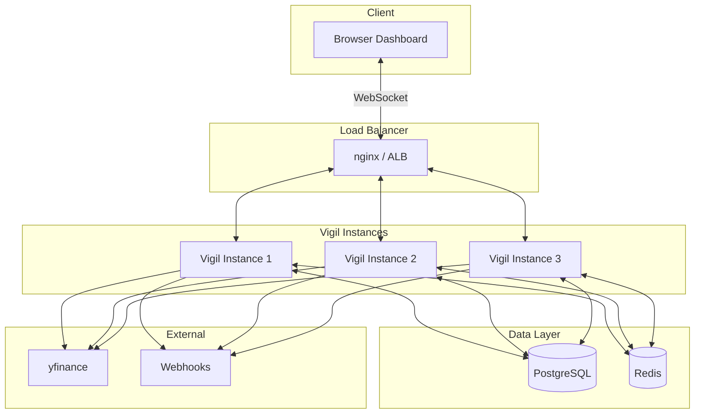

# Vigil Next-Generation Architecture Specification

**Version:** 1.0  
**Date:** 2026-03-30  
**Author:** Architect Mode  
**Status:** Draft — Review Required

---

## Table of Contents

1. [Executive Summary](#1-executive-summary)
2. [Current State Assessment](#2-current-state-assessment)
3. [Feature Specifications](#3-feature-specifications)
   - [3.1 Real-Time Event-Driven Streaming](#31-real-time-event-driven-streaming)
   - [3.2 Adaptive Regime Detection with Dynamic Thresholds](#32-adaptive-regime-detection-with-dynamic-thresholds)
   - [3.3 Multi-Asset Portfolio Correlation Modeling](#33-multi-asset-portfolio-correlation-modeling)
   - [3.4 Automated Backtesting Infrastructure](#34-automated-backtesting-infrastructure)
   - [3.5 Fault-Tolerant Alert Routing](#35-fault-tolerant-alert-routing)
   - [3.6 Comprehensive Observability](#36-comprehensive-observability)
   - [3.7 Horizontal Scalability](#37-horizontal-scalability)
   - [3.8 Security Hardening](#38-security-hardening)
4. [Module Breakdown](#4-module-breakdown)
5. [Implementation Phases](#5-implementation-phases)
6. [Testing Strategy](#6-testing-strategy)
7. [Performance Benchmarks](#7-performance-benchmarks)
8. [Risk Register](#8-risk-register)

---

## 1. Executive Summary

### Vision

Transform Vigil from a single-instance, daily-batch market surveillance tool into a **production-grade, horizontally scalable, real-time trading intelligence platform** capable of:

- Sub-second alert delivery via WebSocket push
- Adaptive signal thresholds that calibrate to market conditions
- Multi-asset portfolio risk analytics
- Automated backtesting with walk-forward optimization
- Fault-tolerant, multi-channel alert delivery with audit trails
- Full observability for SRE-grade operational confidence

### Prioritization Matrix

| Priority | Feature | Rationale |
|----------|---------|-----------|
| P0 — Critical | Security Hardening | Prerequisite for any production deployment with real capital |
| P0 — Critical | Fault-Tolerant Alert Routing | Core value proposition — alerts must be reliable |
| P1 — High | Real-Time Event-Driven Streaming | Eliminates polling latency, enables live trading workflows |
| P1 — High | Comprehensive Observability | Required to operate and debug a production system |
| P1 — High | Horizontal Scalability | Enables multi-instance deployment and zero-downtime releases |
| P2 — Medium | Adaptive Regime Detection | Improves signal quality; reduces false positives |
| P2 — Medium | Automated Backtesting Infrastructure | Validates strategy before live deployment |
| P3 — Lower | Multi-Asset Correlation Modeling | Advanced portfolio analytics; nice-to-have for single-asset users |

### Architectural Principles

1. **PostgreSQL-first** — All persistent state lives in PostgreSQL; no MongoDB, DynamoDB, etc.
2. **Stateless API** — API processes hold no mutable state; all state is in the database or cache.
3. **Event-driven** — Replace polling with push-based event delivery.
4. **Graceful degradation** — System continues operating when optional components (Redis, external APIs) are unavailable.
5. **Python 3.10+** — Leverage modern Python features (match/case, structural pattern matching, type hints).

---

## 2. Current State Assessment

### 2.1 Architecture Overview

```
┌─────────────────────────────────────────────────────────────┐
│                        Client Browser                       │
│  ┌──────────────┐  ┌──────────────┐  ┌──────────────────┐  │
│  │ dashboard.html│  │  vigil.js    │  │  (polls /alerts) │  │
│  └──────┬───────┘  └──────┬───────┘  └────────┬─────────┘  │
└─────────┼─────────────────┼───────────────────┼────────────┘
          │                 │                   │
          ▼                 ▼                   ▼
┌─────────────────────────────────────────────────────────────┐
│                     api.py (Flask + SocketIO)               │
│  - BackgroundScheduler (daily 21:00 ET)                     │
│  - REST endpoints: /alerts, /regime, /trigger, /backfill    │
│  - Flask-SocketIO declared but unused for push              │
│  - Thread-per-request detection via threading.Thread        │
└────────────────────────┬────────────────────────────────────┘
                         │
          ┌──────────────┼──────────────┐
          ▼              ▼              ▼
┌──────────────┐ ┌──────────────┐ ┌──────────────┐
│   data.py    │ │ database.py  │ │ advanced_    │
│ Detection    │ │ PostgreSQL   │ │ signals.py   │
│ Engine       │ │ Connection   │ │ Multi-Factor │
│ yfinance     │ │ Pool (1-10)  │ │ Signal Engine│
└──────────────┘ └──────────────┘ └──────────────┘
```

### 2.2 Strengths

| Area | Detail |
|------|--------|
| **Signal Engine** | Sophisticated multi-factor analysis: trap detection, accumulation, MTF alignment, regime awareness, edge scoring |
| **Database Layer** | Thread-safe connection pool with double-checked locking; parameterized queries; context manager pattern |
| **Closed-Loop Design** | Alerts → outcomes → analysis → tuning pipeline exists conceptually |
| **Code Organization** | Clean separation: api.py (HTTP), data.py (detection), database.py (persistence), advanced_signals.py (analytics) |
| **Webhook Integration** | Discord/Slack embeds with rich formatting already implemented |
| **Frontend** | Modern dashboard with decay tracking, expandable cards, edge breakdown visualization |

### 2.3 Weaknesses and Technical Debt

| Issue | Severity | Impact | Root Cause |
|-------|----------|--------|------------|
| **Competing schedulers** | HIGH | Duplicate detection runs, resource contention | `BackgroundScheduler` in api.py AND `BlockingScheduler` in scheduler.py both schedule `run_detection` at 21:00 ET |
| **Sequential yfinance downloads** | HIGH | Detection takes 30-60s for 5+ tickers | `yf.Ticker(ticker).history()` called one-at-a time in a for loop in `run_detection()` |
| **No input validation** | HIGH | SQL injection risk, malformed requests | Endpoints accept any query params without type/range checking |
| **Hardcoded thresholds** | MEDIUM | Cannot tune without code changes | `DEFAULT_TICKERS`, `LOOKBACK_PERIOD`, volume ratios (1.5x), change thresholds (2%) all hardcoded in data.py |
| **No WebSocket push** | MEDIUM | Dashboard polls every 60s; alert latency up to 60s | `Flask-SocketIO` is initialized but `emit()` is never called |
| **No database migrations** | MEDIUM | Schema changes are ad-hoc ALTER TABLE on startup | `init_db()` uses `CREATE TABLE IF NOT EXISTS` + `ALTER TABLE ADD COLUMN IF NOT EXISTS` — no version tracking |
| **No observability** | MEDIUM | Cannot measure latency, error rates, or system health | No structured logging, no metrics export, no health check endpoint |
| **Thread-per-request detection** | MEDIUM | Unbounded thread creation under load | `/trigger` and `/backfill` spawn `threading.Thread()` with no pool or limit |
| **No rate limiting** | MEDIUM | API can be abused | No rate limiting on any endpoint |
| **No JWT authentication** | LOW | Only optional `X-API-KEY` header on select endpoints | `require_api_key` decorator is optional and only protects `/trigger` and `/backfill` |
| **Single-instance design** | LOW | Cannot scale horizontally | No shared cache, no distributed lock, no session affinity |

### 2.4 Data Flow Analysis

**Current Detection Flow:**
```
scheduler (21:00 ET) OR /trigger endpoint
  → run_detection()
    → yf.Ticker("SPY").history()          [sequential, ~2-3s]
    → for each ticker in watchlist:       [sequential, ~2-3s each]
        → yf.Ticker(ticker).history()
        → compute_state(), compute_mtf(), assess_trap()
        → compute_advanced_signal_analysis()
        → save_alert()
        → notify_webhook()
    → Total: 5 tickers × 3s = ~15s + SPY + sector ETFs = ~30-60s
```

**Bottleneck:** Sequential HTTP requests to Yahoo Finance. Each ticker download blocks the thread.

---

## 3. Feature Specifications

### 3.1 Real-Time Event-Driven Streaming

#### Problem Statement

The dashboard polls `/alerts` every 60 seconds via `setInterval(fetchAll, 60 * 1000)` in [`vigil.js`](static/vigil.js:466). This means:
- New alerts are up to 60 seconds stale before the dashboard sees them
- Unnecessary HTTP load from polling when no new alerts exist
- No real-time push for regime shifts, webhook confirmations, or system health

#### Proposed Solution

Replace polling with **WebSocket push** using the already-declared Flask-SocketIO infrastructure. Implement an in-memory event bus (Phase 1) with optional Redis pub/sub upgrade path (Phase 3).

#### Architectural Modifications

**Files Changed:**
- [`api.py`](api.py) — Add SocketIO event handlers, emit calls after alert creation
- [`data.py`](data.py) — Accept optional `socketio` instance for push notifications
- [`static/vigil.js`](static/vigil.js) — Replace `setInterval` polling with SocketIO client listeners
- **New:** `config/events.py` — Event type definitions and serialization

**New Files:**
```
vigil/
├── config/
│   ├── __init__.py
│   └── events.py          # Event type constants, payload schemas
├── services/
│   ├── __init__.py
│   └── event_bus.py       # In-memory event bus with pub/sub interface
```

**Data Flow (New):**
```
┌──────────────────────────────────────────────────────────────┐
│                      api.py (Flask + SocketIO)               │
│                                                              │
│  run_detection() ──→ save_alert() ──→ emit("new_alert", {   │
│                                         ticker, edge, ...    │
│                                       })                     │
│                                                              │
│  compute_regime() ──→ emit("regime_shift", {                 │
│                         old, new, timestamp                  │
│                       })                                     │
│                                                              │
│  SocketIO namespaces:                                        │
│    /alerts   — New alert events                              │
│    /regime   — Regime change events                          │
│    /system   — Health, error, and metrics events             │
└──────────────────────────────────────────────────────────────┘
          │
          │ WebSocket (persistent connection)
          ▼
┌──────────────────────────────────────────────────────────────┐
│                    vigil.js (Browser)                        │
│                                                              │
│  socket.on("new_alert", (data) => {                          │
│    prependAlert(data);                                       │
│    updateBriefing();                                         │
│  });                                                         │
│                                                              │
│  socket.on("regime_shift", (data) => {                       │
│    showRegimeBanner(data);                                   │
│    updateRegime(data.new);                                   │
│  });                                                         │
│                                                              │
│  Reconnection: auto-reconnect with exponential backoff       │
│  (1s, 2s, 4s, 8s, max 30s) with jitter                      │
└──────────────────────────────────────────────────────────────┘
```

**Connection Management:**
- Flask-SocketIO handles WebSocket upgrade automatically
- Fallback to long-polling for clients without WebSocket support
- Heartbeat: SocketIO ping/pong every 25 seconds (default)
- Reconnection: Client-side exponential backoff with jitter
- Backpressure: Server-side event queue with max 1000 events per namespace; drop oldest when full

**Event Payload Schema:**
```python
# config/events.py
class EventType:
    NEW_ALERT = "new_alert"
    REGIME_SHIFT = "regime_shift"
    DETECTION_COMPLETE = "detection_complete"
    SYSTEM_ERROR = "system_error"
    HEALTH_CHECK = "health_check"

# Payload for NEW_ALERT
{
    "event_type": "new_alert",
    "timestamp": "2026-03-30T21:05:00Z",
    "data": {
        "id": 1234,
        "ticker": "TSLA",
        "signal_type": "VOLUME_SPIKE_UP",
        "signal_combination": "ACCUM_BREAKOUT",
        "edge_score": 8.2,
        "action": "ENTER",
        "regime": "TRENDING",
        "mtf_alignment": "FULL_UP",
        "summary": "5-day accumulation resolved..."
    }
}
```

**Tradeoff Analysis:**

| Aspect | In-Memory Event Bus | Redis Pub/Sub |
|--------|---------------------|---------------|
| Complexity | Low — pure Python | Medium — Redis dependency |
| Multi-instance | No — events lost on other instances | Yes — distributed event delivery |
| Persistence | No | No (use Redis Streams for persistence) |
| Cost | Free | ~$10-30/month managed Redis |
| Recommendation | Phase 1 (single instance) | Phase 3 (multi-instance) |

---

### 3.2 Adaptive Regime Detection with Dynamic Thresholds

#### Problem Statement

Current regime detection in [`data.py`](data.py:138) `compute_regime()` uses hardcoded thresholds:
- ATR > 1.8% → VOLATILE
- SMA20 slope > 0.5% → TRENDING
- These thresholds are static and do not adapt to changing market volatility regimes

#### Proposed Solution

Implement a **multi-timeframe regime classifier** with dynamic threshold calibration based on rolling statistical properties. Add a configuration management layer for all thresholds.

#### Architectural Modifications

**Files Changed:**
- [`data.py`](data.py) — Replace `compute_regime()` with new regime engine
- [`advanced_signals.py`](advanced_signals.py) — Add regime transition logic
- **New:** `config/regime_config.yaml` — Threshold definitions
- **New:** `services/regime_engine.py` — Regime classification engine

**New Module: `services/regime_engine.py`**

```python
class RegimeEngine:
    """
    Multi-timeframe regime classifier with dynamic thresholds.
    
    Regimes: TRENDING, RISK_OFF, SIDEWAYS, VOLATILE, TRANSITION
    """
    
    def __init__(self, config_path: str = "config/regime_config.yaml"):
        self.config = load_config(config_path)
        self.state_machine = RegimeStateMachine()
        self.threshold_calibrator = DynamicThresholdCalibrator()
    
    def classify(self, spy_history: pd.DataFrame, 
                 sector_histories: dict[str, pd.DataFrame]) -> RegimeResult:
        """
        Returns regime with confidence score and contributing factors.
        """
        # 1. Compute rolling statistical properties
        stats = self._compute_market_stats(spy_history)
        
        # 2. Calibrate thresholds based on rolling percentiles
        thresholds = self.threshold_calibrator.calibrate(stats)
        
        # 3. Classify using multi-factor scoring
        regime_scores = self._score_regimes(stats, thresholds)
        
        # 4. Apply state machine with hysteresis
        result = self.state_machine.transition(regime_scores)
        
        return result
```

**Regime State Machine with Hysteresis:**

```
┌─────────────────────────────────────────────────────────────┐
│                  Regime State Machine                       │
│                                                             │
│  TRENDING ──────→ TRANSITION ──────→ RISK_OFF               │
│     ↑                  │                   │                │
│     │                  ▼                   │                │
│     └────────── SIDEWAYS ←─────────────────┘                │
│          ↑                    │                              │
│          └────── VOLATILE ←───┘                              │
│                                                             │
│  Hysteresis: Minimum 3 days in current regime before        │
│  transition allowed. Prevents whipsaw in borderline cases.  │
│                                                             │
│  Confidence threshold: New regime must score > 0.6 AND      │
│  current regime score < 0.4 for transition.                 │
└─────────────────────────────────────────────────────────────┘
```

**Configuration File: `config/regime_config.yaml`**

```yaml
regime:
  lookback_periods:
    short: 20    # 1 month
    medium: 60   # 3 months
    long: 252    # 1 year
  
  thresholds:
    atr_percentile: 80      # VOLATILE if ATR > 80th percentile of 60d history
    sma_slope_min: 0.3      # TRENDING if SMA20 slope > 0.3%
    rsi_extreme_upper: 70   # Overbought threshold
    rsi_extreme_lower: 30   # Oversold threshold
  
  hysteresis:
    min_days_in_regime: 3
    confidence_threshold: 0.6
    current_regime_decay: 0.4
  
  multi_timeframe:
    weekly_weight: 0.4
    daily_weight: 0.4
    intraday_weight: 0.2
```

**Dynamic Threshold Calibration:**

Instead of fixed ATR > 1.8%, the system computes:
```python
# Rolling percentile-based threshold
atr_60d = history["High"] - history["Low"]  # simplified
current_atr_pct = atr_60d.rolling(14).mean().iloc[-1] / close_price * 100
atr_percentile = (atr_60d.rolling(60).apply(lambda x: (x < current_atr_pct).mean()) * 100).iloc[-1]

if atr_percentile > config.thresholds.atr_percentile:
    regime = "VOLATILE"
```

**Tradeoff Analysis:**

| Aspect | Static Thresholds | Dynamic Thresholds |
|--------|-------------------|-------------------|
| Complexity | Low | Medium |
| Adaptability | None — breaks in new regimes | Self-calibrating |
| Backtestability | Easy | Requires historical calibration data |
| False positives | High in regime shifts | Lower, but lag during transitions |
| Recommendation | Replace entirely | — |

---

### 3.3 Multi-Asset Portfolio Correlation Modeling

#### Problem Statement

Vigil currently analyzes tickers in isolation. There is no understanding of:
- How correlated positions are to each other
- Portfolio-level risk concentration
- Cross-asset relationships (equities ↔ FX ↔ commodities ↔ rates)

#### Proposed Solution

Build a **correlation matrix engine** that computes rolling correlations, stability scores, and portfolio-level risk metrics. Store results in PostgreSQL for API consumption.

#### Architectural Modifications

**New Files:**
```
vigil/
├── services/
│   ├── correlation_engine.py    # Correlation matrix computation
│   └── portfolio_risk.py        # VaR, ES, drawdown attribution
├── models/
│   └── correlation.py           # SQLAlchemy models for correlation data
```

**Database Schema Additions:**

```sql
CREATE TABLE IF NOT EXISTS correlation_matrix (
    id SERIAL PRIMARY KEY,
    computed_at TIMESTAMPTZ DEFAULT NOW(),
    lookback_days INTEGER NOT NULL,
    assets TEXT[] NOT NULL,
    matrix JSONB NOT NULL,              -- Full correlation matrix
    stability_scores JSONB,             -- Per-pair stability (rolling correlation std)
    regime TEXT                         -- Regime during computation
);

CREATE TABLE IF NOT EXISTS portfolio_risk (
    id SERIAL PRIMARY KEY,
    computed_at TIMESTAMPTZ DEFAULT NOW(),
    portfolio_var_95 REAL,              -- 95% Value at Risk
    expected_shortfall REAL,            -- Conditional VaR
    max_drawdown_contribution JSONB,    -- Per-asset drawdown contribution
    correlation_concentration REAL,     -- Herfindahl index of correlation matrix
    regime TEXT
);
```

**Correlation Engine Design:**

```python
class CorrelationEngine:
    """
    Computes rolling correlation matrices with stability scoring.
    """
    
    def compute_correlation_matrix(
        self, 
        asset_histories: dict[str, pd.DataFrame],
        lookback: int = 60,
        method: str = "pearson"  # or "spearman"
    ) -> CorrelationResult:
        """
        Returns:
        - Full correlation matrix (N×N)
        - Stability score per pair (rolling std of correlation)
        - Clustered asset groups (hierarchical clustering)
        """
        returns = {ticker: hist["Close"].pct_change() 
                   for ticker, hist in asset_histories.items()}
        returns_df = pd.DataFrame(returns).dropna()
        
        # Rolling correlation
        rolling_corr = returns_df.rolling(lookback).corr()
        
        # Stability: std of rolling correlation over time
        stability = self._compute_stability(returns_df, lookback)
        
        # Cluster assets by correlation
        clusters = self._cluster_assets(rolling_corr.iloc[-1])
        
        return CorrelationResult(
            matrix=rolling_corr.iloc[-1],
            stability=stability,
            clusters=clusters
        )
    
    def compute_portfolio_risk(
        self,
        positions: dict[str, float],  # ticker → weight
        correlation_matrix: pd.DataFrame,
        volatilities: dict[str, float],
        confidence: float = 0.95
    ) -> PortfolioRisk:
        """
        Parametric VaR, Expected Shortfall, drawdown attribution.
        """
        # Portfolio variance: w' Σ w
        weights = np.array([positions.get(t, 0) for t in correlation_matrix.columns])
        cov_matrix = self._build_cov_matrix(correlation_matrix, volatilities)
        portfolio_var = weights @ cov_matrix @ weights
        
        var_95 = np.sqrt(portfolio_var) * norm.ppf(confidence)
        es_95 = np.sqrt(portfolio_var) * norm.pdf(norm.ppf(confidence)) / (1 - confidence)
        
        return PortfolioRisk(var_95=var_95, expected_shortfall=es_95)
```

**API Endpoint:**

```python
@app.route("/portfolio/correlation")
def portfolio_correlation():
    """Returns current correlation matrix and stability scores."""
    engine = CorrelationEngine()
    result = engine.compute_correlation_matrix(get_asset_histories())
    return jsonify({
        "matrix": result.matrix.to_dict(),
        "stability": result.stability,
        "clusters": result.clusters,
        "computed_at": result.computed_at.isoformat()
    })

@app.route("/portfolio/risk")
def portfolio_risk():
    """Returns portfolio-level risk metrics."""
    return jsonify(get_latest_portfolio_risk())
```

**Tradeoff Analysis:**

| Aspect | Detail |
|--------|--------|
| Complexity | Medium — requires pandas/numpy matrix operations |
| Data requirements | 60+ days of history per asset |
| Performance | O(N²) for N assets; fine for <50 assets |
| Storage | JSONB in PostgreSQL; ~10KB per computation |
| Update frequency | Daily (after detection run) |

---

### 3.4 Automated Backtesting Infrastructure

#### Problem Statement

Vigil generates signals and evaluates outcomes, but there is no:
- Event-driven backtesting engine with realistic slippage/commission
- Walk-forward optimization support
- Performance attribution (Sharpe, Sortino, Calmar)
- Result storage and comparison API

#### Proposed Solution

Build an **event-driven backtesting engine** that replays historical signals with realistic execution modeling. Store results in PostgreSQL for comparison via API.

#### Architectural Modifications

**New Files:**
```
vigil/
├── backtest/
│   ├── __init__.py
│   ├── engine.py              # Event-driven backtesting engine
│   ├── broker.py              # Simulated broker with slippage/commission
│   ├── metrics.py             # Performance attribution calculations
│   └── optimizer.py           # Walk-forward optimization
├── models/
│   └── backtest_result.py     # SQLAlchemy models for backtest results
```

**Database Schema Additions:**

```sql
CREATE TABLE IF NOT EXISTS backtest_runs (
    id SERIAL PRIMARY KEY,
    name TEXT NOT NULL,
    config JSONB NOT NULL,              -- Parameters used
    start_date DATE NOT NULL,
    end_date DATE NOT NULL,
    tickers TEXT[] NOT NULL,
    created_at TIMESTAMPTZ DEFAULT NOW(),
    status TEXT DEFAULT 'running'       -- running, complete, failed
);

CREATE TABLE IF NOT EXISTS backtest_results (
    id SERIAL PRIMARY KEY,
    run_id INTEGER REFERENCES backtest_runs(id),
    ticker TEXT,
    entry_date DATE,
    entry_price REAL,
    exit_date DATE,
    exit_price REAL,
    pnl_pct REAL,
    pnl_dollars REAL,
    slippage_bps REAL,
    commission REAL,
    mae REAL,
    mfe REAL,
    hold_days INTEGER
);

CREATE TABLE IF NOT EXISTS backtest_metrics (
    id SERIAL PRIMARY KEY,
    run_id INTEGER REFERENCES backtest_runs(id),
    total_return_pct REAL,
    annualized_return_pct REAL,
    sharpe_ratio REAL,
    sortino_ratio REAL,
    calmar_ratio REAL,
    max_drawdown_pct REAL,
    win_rate REAL,
    profit_factor REAL,
    avg_win_pct REAL,
    avg_loss_pct REAL,
    total_trades INTEGER,
    avg_hold_days REAL
);
```

**Backtesting Engine Design:**

```python
class BacktestEngine:
    """
    Event-driven backtesting engine.
    
    Replays historical signals with realistic execution.
    """
    
    def __init__(self, broker: SimulatedBroker):
        self.broker = broker
        self.events: list[BacktestEvent] = []
        self.equity_curve: list[EquityPoint] = []
    
    def load_signals(self, start_date: str, end_date: str, 
                     tickers: list[str]) -> list[Signal]:
        """Load historical signals from database."""
        # Query alerts table for signals in date range
        pass
    
    def run(self) -> BacktestResult:
        """Execute backtest."""
        for event in sorted(self.events, key=lambda e: e.timestamp):
            if event.type == "SIGNAL":
                self.broker.on_signal(event)
            elif event.type == "BAR":
                self.broker.on_bar(event)
                self._record_equity()
        
        return BacktestResult(
            equity_curve=self.equity_curve,
            trades=self.broker.trades,
            metrics=compute_metrics(self.equity_curve, self.broker.trades)
        )
```

**Simulated Broker:**

```python
class SimulatedBroker:
    """
    Realistic execution simulation.
    """
    
    def __init__(self, 
                 slippage_model: str = "volume_weighted",  # or "fixed_bps"
                 commission_bps: float = 10,               # 10 bps = 0.1%
                 max_slippage_bps: float = 50):
        self.slippage_model = slippage_model
        self.commission_bps = commission_bps
        self.trades: list[Trade] = []
    
    def on_signal(self, signal: Signal):
        """Process signal → generate order."""
        if signal.action == "ENTER":
            order = Order(
                ticker=signal.ticker,
                side="BUY",
                size=self._compute_size(signal.edge_score),
                limit_price=signal.close_price
            )
            self.submit_order(order)
    
    def on_bar(self, bar: Bar):
        """Process price bar → fill orders, update positions."""
        for order in self.pending_orders:
            if self._can_fill(order, bar):
                fill_price = self._apply_slippage(order, bar)
                commission = fill_price * order.size * self.commission_bps / 10000
                self.trades.append(Trade(
                    ticker=order.ticker,
                    fill_price=fill_price,
                    commission=commission,
                    slippage_bps=abs(fill_price - order.limit_price) / order.limit_price * 10000
                ))
```

**Performance Metrics:**

```python
def compute_metrics(equity_curve: list[EquityPoint], 
                    trades: list[Trade]) -> PerformanceMetrics:
    returns = pd.Series([t.pnl_pct for t in trades])
    
    # Annualized Sharpe (assuming 252 trading days)
    sharpe = (returns.mean() / returns.std()) * np.sqrt(252) if returns.std() > 0 else 0
    
    # Sortino (downside deviation only)
    downside = returns[returns < 0]
    sortino = (returns.mean() / downside.std()) * np.sqrt(252) if len(downside) > 0 else 0
    
    # Calmar (return / max drawdown)
    equity = pd.Series([e.value for e in equity_curve])
    max_dd = ((equity - equity.cummax()) / equity.cummax()).min()
    calmar = returns.sum() / abs(max_dd) if max_dd != 0 else 0
    
    # Profit factor
    wins = returns[returns > 0].sum()
    losses = abs(returns[returns < 0].sum())
    profit_factor = wins / losses if losses > 0 else wins
    
    return PerformanceMetrics(
        sharpe_ratio=round(sharpe, 2),
        sortino_ratio=round(sortino, 2),
        calmar_ratio=round(calmar, 2),
        profit_factor=round(profit_factor, 2),
        win_rate=round(len(returns[returns > 0]) / len(returns) * 100, 1),
        max_drawdown_pct=round(max_dd * 100, 2),
        total_trades=len(trades)
    )
```

**Walk-Forward Optimization:**

```python
class WalkForwardOptimizer:
    """
    Walk-forward optimization with rolling windows.
    """
    
    def optimize(self, 
                 param_grid: dict,
                 train_days: int = 180,
                 test_days: int = 30,
                 step_days: int = 30) -> OptimizationResult:
        """
        For each window:
        1. Optimize parameters on train period
        2. Validate on test period
        3. Roll forward by step_days
        """
        results = []
        for train_start, train_end, test_start, test_end in self._generate_windows():
            best_params = self._optimize_window(train_start, train_end, param_grid)
            test_result = self._validate_window(test_start, test_end, best_params)
            results.append(WalkForwardWindow(
                train_period=(train_start, train_end),
                test_period=(test_start, test_end),
                best_params=best_params,
                test_metrics=test_result.metrics
            ))
        
        return OptimizationResult(windows=results)
```

**API Endpoints:**

```python
@app.route("/backtest/run", methods=["POST"])
@require_api_key
def backtest_run():
    """Start a backtest run."""
    config = request.json
    run_id = start_backtest(config)
    return jsonify({"run_id": run_id, "status": "started"})

@app.route("/backtest/<int:run_id>")
def backtest_status(run_id):
    """Get backtest status and results."""
    return jsonify(get_backtest_result(run_id))

@app.route("/backtest/compare")
def backtest_compare():
    """Compare multiple backtest runs."""
    run_ids = request.args.getlist("run_id", type=int)
    return jsonify(compare_backtests(run_ids))
```

**Tradeoff Analysis:**

| Aspect | Detail |
|--------|--------|
| Complexity | High — event-driven engine with realistic execution |
| Data requirements | Historical OHLCV for all backtest period |
| Execution time | Minutes to hours for large parameter grids |
| Recommendation | Run as background job; store results in PostgreSQL |

---

### 3.5 Fault-Tolerant Alert Routing

#### Problem Statement

Current webhook delivery in [`data.py`](data.py:432) `notify_webhook()` has:
- No retry logic — single attempt, then silent failure
- No deduplication — same alert could be sent multiple times
- No rate limiting — could overwhelm webhook endpoints
- Only one channel (Discord/Slack webhook)
- No delivery confirmation or audit trail

#### Proposed Solution

Build a **multi-channel alert router** with retry logic, deduplication, rate limiting, and delivery confirmation.

#### Architectural Modifications

**New Files:**
```
vigil/
├── services/
│   ├── alert_router.py          # Multi-channel alert dispatcher
│   ├── channels/
│   │   ├── __init__.py
│   │   ├── webhook.py           # Discord/Slack webhook
│   │   ├── email.py             # SMTP email alerts
│   │   ├── sms.py               # Twilio SMS
│   │   └── slack_api.py         # Slack API (alternative to webhook)
│   ├── dedup.py                 # Alert deduplication
│   └── rate_limiter.py          # Per-channel rate limiting
├── models/
│   └── alert_delivery.py        # SQLAlchemy models for delivery tracking
```

**Database Schema Additions:**

```sql
CREATE TABLE IF NOT EXISTS alert_deliveries (
    id SERIAL PRIMARY KEY,
    alert_id INTEGER REFERENCES alerts(id),
    channel TEXT NOT NULL,              -- webhook, email, sms, slack
    recipient TEXT NOT NULL,            -- URL, email, phone
    status TEXT DEFAULT 'pending',      -- pending, sent, failed, dead_letter
    attempts INTEGER DEFAULT 0,
    last_attempt_at TIMESTAMPTZ,
    next_retry_at TIMESTAMPTZ,
    error_message TEXT,
    response_code INTEGER,
    sent_at TIMESTAMPTZ,
    created_at TIMESTAMPTZ DEFAULT NOW()
);

CREATE TABLE IF NOT EXISTS alert_dedup (
    id SERIAL PRIMARY KEY,
    fingerprint TEXT UNIQUE NOT NULL,   -- hash of alert content
    alert_id INTEGER REFERENCES alerts(id),
    created_at TIMESTAMPTZ DEFAULT NOW(),
    expires_at TIMESTAMPTZ              -- TTL for dedup window
);
```

**Alert Router Design:**

```python
class AlertRouter:
    """
    Multi-channel alert dispatcher with retry and dedup.
    """
    
    def __init__(self, config: AlertRouterConfig):
        self.channels: dict[str, AlertChannel] = {}
        self.dedup = DeduplicationStore(ttl_hours=24)
        self.rate_limiter = RateLimiter(config.rate_limits)
        self.retry_policy = RetryPolicy(
            max_attempts=3,
            backoff_base=2,      # 2s, 4s, 8s
            backoff_max=60,      # cap at 60s
            jitter=True
        )
    
    def dispatch(self, alert: Alert) -> list[DeliveryResult]:
        """
        Route alert to all configured channels.
        """
        # 1. Deduplication check
        fingerprint = self.dedup.fingerprint(alert)
        if self.dedup.exists(fingerprint):
            logger.info(f"Duplicate alert suppressed: {fingerprint}")
            return []
        self.dedup.record(fingerprint, alert.id)
        
        # 2. Route to channels
        results = []
        for channel in self._get_channels_for_alert(alert):
            # Rate limit check
            if not self.rate_limiter.allow(channel.name):
                logger.warning(f"Rate limited: {channel.name}")
                results.append(DeliveryResult(channel.name, "rate_limited"))
                continue
            
            # Async dispatch with retry
            result = self._dispatch_with_retry(channel, alert)
            results.append(result)
        
        return results
    
    def _dispatch_with_retry(self, channel: AlertChannel, 
                              alert: Alert) -> DeliveryResult:
        """
        Dispatch with exponential backoff retry.
        """
        for attempt in range(self.retry_policy.max_attempts):
            try:
                response = channel.send(alert)
                self._record_delivery(alert.id, channel.name, "sent", response)
                return DeliveryResult(channel.name, "sent")
            except Exception as e:
                wait = self.retry_policy.backoff(attempt)
                logger.warning(f"Channel {channel.name} attempt {attempt+1} failed: {e}. Retrying in {wait}s")
                time.sleep(wait)
        
        # All retries exhausted → dead letter
        self._record_delivery(alert.id, channel.name, "dead_letter", error=str(e))
        return DeliveryResult(channel.name, "dead_letter")
```

**Deduplication:**

```python
class DeduplicationStore:
    """
    Prevents duplicate alerts within a time window.
    """
    
    def fingerprint(self, alert: Alert) -> str:
        """
        Generate fingerprint from alert content.
        Same ticker + signal_type + date = duplicate.
        """
        content = f"{alert.ticker}:{alert.signal_type}:{alert.date}"
        return hashlib.sha256(content.encode()).hexdigest()
    
    def exists(self, fingerprint: str) -> bool:
        """Check if fingerprint exists and is not expired."""
        with get_db_cursor() as cursor:
            cursor.execute("""
                SELECT id FROM alert_dedup 
                WHERE fingerprint = %s AND expires_at > NOW()
            """, (fingerprint,))
            return cursor.fetchone() is not None
    
    def record(self, fingerprint: str, alert_id: int):
        """Record fingerprint with TTL."""
        with get_db_cursor() as cursor:
            cursor.execute("""
                INSERT INTO alert_dedup (fingerprint, alert_id, expires_at)
                VALUES (%s, %s, NOW() + INTERVAL '24 hours')
                ON CONFLICT (fingerprint) DO UPDATE SET expires_at = NOW() + INTERVAL '24 hours'
            """, (fingerprint, alert_id))
```

**Rate Limiting:**

```python
class RateLimiter:
    """
    Per-channel rate limiting with sliding window.
    """
    
    def __init__(self, limits: dict[str, RateLimit]):
        self.limits = limits  # channel → (max_per_window, window_seconds)
    
    def allow(self, channel: str) -> bool:
        """Check if channel can send another alert."""
        limit = self.limits.get(channel, RateLimit(10, 3600))  # default: 10/hour
        with get_db_cursor() as cursor:
            cursor.execute("""
                SELECT COUNT(*) FROM alert_deliveries
                WHERE channel = %s AND sent_at > NOW() - INTERVAL '%s seconds'
            """, (channel, limit.window_seconds))
            count = cursor.fetchone()[0]
            return count < limit.max_per_window
```

**Tradeoff Analysis:**

| Aspect | Current (notify_webhook) | New (AlertRouter) |
|--------|--------------------------|-------------------|
| Retry | None | 3 attempts with exponential backoff |
| Deduplication | None | 24-hour fingerprint window |
| Rate limiting | None | Per-channel sliding window |
| Channels | 1 (webhook) | 4+ (webhook, email, SMS, Slack) |
| Audit trail | None | Full delivery tracking in PostgreSQL |
| Dead letter | None | Dead-letter queue for failed deliveries |

---

### 3.6 Comprehensive Observability

#### Problem Statement

Vigil has no:
- Request latency tracking (p50, p95, p99)
- Error rate monitoring
- Structured logging
- Health check endpoints
- Metrics export

#### Proposed Solution

Add a **middleware-based observability layer** that tracks all requests, exports metrics, and provides health check endpoints.

#### Architectural Modifications

**Files Changed:**
- [`api.py`](api.py) — Add middleware, health endpoint, structured logging
- **New:** `services/observability.py` — Metrics collection and export
- **New:** `services/health.py` — Health check implementation

**New Files:**
```
vigil/
├── services/
│   ├── observability.py         # Request metrics, latency tracking
│   └── health.py                # Health check endpoints
```

**Request Latency Tracking (Flask Middleware):**

```python
# services/observability.py
import time
import logging
from flask import request, g
from prometheus_client import Histogram, Counter, Gauge

# Prometheus metrics
REQUEST_LATENCY = Histogram(
    'vigil_request_latency_seconds',
    'Request latency in seconds',
    ['method', 'endpoint', 'status']
)
REQUEST_COUNT = Counter(
    'vigil_request_total',
    'Total requests',
    ['method', 'endpoint', 'status']
)
ERROR_COUNT = Counter(
    'vigil_errors_total',
    'Total errors',
    ['type', 'endpoint']
)
ACTIVE_REQUESTS = Gauge(
    'vigil_active_requests',
    'Number of active requests'
)

class MetricsMiddleware:
    def __init__(self, app):
        self.app = app
    
    def before_request(self):
        g.start_time = time.time()
        ACTIVE_REQUESTS.inc()
    
    def after_request(self, response):
        if hasattr(g, 'start_time'):
            latency = time.time() - g.start_time
            ACTIVE_REQUESTS.dec()
            
            REQUEST_LATENCY.labels(
                method=request.method,
                endpoint=request.endpoint or "unknown",
                status=response.status_code
            ).observe(latency)
            
            REQUEST_COUNT.labels(
                method=request.method,
                endpoint=request.endpoint or "unknown",
                status=response.status_code
            ).inc()
            
            if response.status_code >= 500:
                ERROR_COUNT.labels(
                    type="server_error",
                    endpoint=request.endpoint or "unknown"
                ).inc()
        
        return response
```

**Structured Logging:**

```python
# Replace basic logging with structured JSON logging
import json
import logging

class JSONFormatter(logging.Formatter):
    def format(self, record):
        log_entry = {
            "timestamp": self.formatTime(record),
            "level": record.levelname,
            "logger": record.name,
            "message": record.getMessage(),
            "module": record.module,
            "function": record.funcName,
            "line": record.lineno,
        }
        if record.exc_info:
            log_entry["exception"] = self.formatException(record.exc_info)
        return json.dumps(log_entry)

# Configure root logger
handler = logging.StreamHandler()
handler.setFormatter(JSONFormatter())
logging.basicConfig(level=logging.INFO, handlers=[handler])
```

**Health Check Endpoints:**

```python
# services/health.py
@app.route("/health")
def health_check():
    """
    Basic health check for load balancers.
    Returns 200 if the process is alive.
    """
    return jsonify({"status": "healthy", "timestamp": datetime.now(timezone.utc).isoformat()})

@app.route("/health/ready")
def readiness_check():
    """
    Readiness check — returns 200 only if all dependencies are available.
    """
    checks = {}
    
    # Database check
    try:
        with get_db_cursor() as cursor:
            cursor.execute("SELECT 1")
        checks["database"] = "healthy"
    except Exception as e:
        checks["database"] = f"unhealthy: {str(e)}"
    
    # Detection engine check (last run within 25 hours)
    try:
        last_run = get_last_detection_time()
        if last_run and (datetime.now(timezone.utc) - last_run).total_seconds() < 90000:
            checks["detection"] = "healthy"
        else:
            checks["detection"] = "stale"
    except Exception as e:
        checks["detection"] = f"error: {str(e)}"
    
    all_healthy = all(v == "healthy" for v in checks.values())
    status_code = 200 if all_healthy else 503
    
    return jsonify({
        "status": "ready" if all_healthy else "not_ready",
        "checks": checks,
        "timestamp": datetime.now(timezone.utc).isoformat()
    }), status_code

@app.route("/health/live")
def liveness_check():
    """
    Liveness check — returns 200 if the process is not deadlocked.
    """
    return jsonify({"status": "alive"})

@app.route("/metrics")
def prometheus_metrics():
    """
    Prometheus-compatible metrics endpoint.
    """
    from prometheus_client import generate_latest, CONTENT_TYPE_LATEST
    return generate_latest(), 200, {'Content-Type': CONTENT_TYPE_LATEST}
```

**System Anomaly Detection:**

```python
class SystemAnomalyDetector:
    """
    Detects anomalies in system metrics (CPU, memory, queue depth).
    """
    
    def __init__(self, window_size: int = 100):
        self.window_size = window_size
        self.cpu_history: deque = deque(maxlen=window_size)
        self.memory_history: deque = deque(maxlen=window_size)
    
    def check(self) -> AnomalyResult:
        import psutil
        cpu = psutil.cpu_percent(interval=1)
        memory = psutil.virtual_memory().percent
        
        self.cpu_history.append(cpu)
        self.memory_history.append(memory)
        
        anomalies = []
        if len(self.cpu_history) >= 10:
            cpu_mean = np.mean(self.cpu_history)
            cpu_std = np.std(self.cpu_history)
            if cpu > cpu_mean + 3 * cpu_std:
                anomalies.append(f"CPU anomaly: {cpu}% (mean: {cpu_mean:.1f}%, std: {cpu_std:.1f}%)")
        
        if memory > 85:
            anomalies.append(f"High memory usage: {memory}%")
        
        return AnomalyResult(anomalies=anomalies, cpu=cpu, memory=memory)
```

**Tradeoff Analysis:**

| Aspect | Detail |
|--------|--------|
| Overhead | ~1-2ms per request for latency tracking |
| Storage | Prometheus metrics are in-memory; no DB impact |
| Dependencies | `prometheus-client` package (~50KB) |
| Recommendation | Essential for production — implement in Phase 1 |

---

### 3.7 Horizontal Scalability

#### Problem Statement

Vigil is designed as a single-instance application:
- Detection runs in-process
- No shared cache between instances
- No distributed locking for scheduled jobs
- Cannot deploy multiple instances behind a load balancer

#### Proposed Solution

Make the API stateless and introduce Redis for shared state (caching, distributed locks, event bus).

#### Architectural Modifications

**Files Changed:**
- [`api.py`](api.py) — Remove in-process scheduler; make stateless
- [`database.py`](database.py) — Connection pool sizing guidelines
- [`scheduler.py`](scheduler.py) — Replace with distributed scheduler
- **New:** `services/cache.py` — Redis caching layer
- **New:** `services/distributed_lock.py` — Distributed locking

**Stateless API Design:**

```
┌─────────────────────────────────────────────────────────────┐
│                    Load Balancer (nginx)                    │
└────────┬──────────────┬──────────────┬─────────────────────┘
         │              │              │
         ▼              ▼              ▼
┌──────────────┐ ┌──────────────┐ ┌──────────────┐
│  Vigil #1    │ │  Vigil #2    │ │  Vigil #3    │
│  (stateless) │ │  (stateless) │ │  (stateless) │
└──────┬───────┘ └──────┬───────┘ └──────┬───────┘
       │                │                │
       └────────────────┼────────────────┘
                        │
          ┌─────────────┼─────────────┐
          ▼             ▼             ▼
┌──────────────┐ ┌──────────────┐ ┌──────────────┐
│  PostgreSQL  │ │    Redis     │ │  Event Bus   │
│  (state)     │ │  (cache)     │ │  (pub/sub)   │
└──────────────┘ └──────────────┘ └──────────────┘
```

**Redis Caching Strategy:**

```python
# services/cache.py
import redis
import json
from functools import wraps

redis_client = redis.Redis(
    host=os.environ.get("REDIS_HOST", "localhost"),
    port=int(os.environ.get("REDIS_PORT", 6379)),
    db=0,
    decode_responses=True
)

def cache_result(key_prefix: str, ttl: int = 300):
    """
    Decorator to cache function results in Redis.
    """
    def decorator(func):
        @wraps(func)
        def wrapper(*args, **kwargs):
            cache_key = f"{key_prefix}:{hash(str(args) + str(kwargs))}"
            cached = redis_client.get(cache_key)
            if cached:
                return json.loads(cached)
            
            result = func(*args, **kwargs)
            redis_client.setex(cache_key, ttl, json.dumps(result))
            return result
        return wrapper
    return decorator

# Usage:
@cache_result("regime", ttl=3600)  # Cache for 1 hour
def compute_regime(history_spy):
    ...

@cache_result("correlation_matrix", ttl=86400)  # Cache for 24 hours
def compute_correlation_matrix(...):
    ...
```

**Distributed Locking for Scheduled Jobs:**

```python
# services/distributed_lock.py
from redis.lock import Lock

class DistributedScheduler:
    """
    Ensures only one instance runs the detection job.
    """
    
    def __init__(self, lock_timeout: int = 3600):
        self.lock = Lock(
            redis_client,
            "vigil:detection_lock",
            timeout=lock_timeout,
            blocking_timeout=10
        )
    
    def run_detection_if_leader(self):
        """
        Only run detection if this instance holds the lock.
        """
        if self.lock.acquire(blocking=False):
            try:
                logger.info("Acquired detection lock — running detection")
                run_detection()
            finally:
                self.lock.release()
        else:
            logger.info("Another instance holds detection lock — skipping")
```

**Database Connection Pool Sizing:**

```python
# database.py — Updated pool sizing
MIN_CONNECTIONS = int(os.environ.get("DB_POOL_MIN", 2))
MAX_CONNECTIONS = int(os.environ.get("DB_POOL_MAX", 20))

# Guidelines:
# - MAX_CONNECTIONS = (CPU cores × 2) + effective_spindle_count
# - For Railway/Heroku: 10-20 connections per instance
# - Total connections across all instances must not exceed PostgreSQL max_connections
# - PostgreSQL default max_connections = 100
# - Recommended: MAX_CONNECTIONS × instances < max_connections × 0.8
```

**Zero-Downtime Deployment Strategy:**

```
Blue-Green Deployment:
┌─────────────────────────────────────────────────────────────┐
│                    Load Balancer                            │
│                                                             │
│  Active:  Blue (v1.0)  ←── serving traffic                 │
│  Standby: Green (v2.0) ←── deploying, running health checks│
│                                                             │
│  When Green passes /health/ready:                           │
│    1. Switch LB to Green                                    │
│    2. Blue becomes standby                                  │
│    3. Drain Blue connections gracefully                     │
└─────────────────────────────────────────────────────────────┘

Rolling Deployment (Kubernetes):
  1. Deploy new pod
  2. Wait for readiness probe (/health/ready) to pass
  3. Add to service endpoints
  4. Remove old pod
  5. Repeat until all pods updated
```

**Tradeoff Analysis:**

| Aspect | Single Instance | Multi-Instance |
|--------|-----------------|----------------|
| Complexity | Low | Medium-High |
| Cost | ~$5-10/month | ~$20-50/month |
| Availability | Single point of failure | High availability |
| Detection runs | One instance | Distributed lock required |
| Recommendation | Phase 1 | Phase 3 |

---

### 3.8 Security Hardening

#### Problem Statement

Current security gaps:
- No rate limiting on any endpoint
- Optional API key only on `/trigger` and `/backfill`
- No input validation or sanitization
- Secrets in environment variables only (no vault integration)
- No CSRF protection
- No CORS restrictions (currently `cors_allowed_origins="*"`)

#### Proposed Solution

Implement defense-in-depth security: rate limiting, JWT authentication, input validation, and secrets management.

#### Architectural Modifications

**Files Changed:**
- [`api.py`](api.py) — Add rate limiting, JWT auth, input validation, CORS restrictions
- **New:** `services/security.py` — Rate limiter, JWT auth, input validation
- **New:** `config/security_config.yaml` — Security configuration

**Rate Limiting:**

```python
# services/security.py
from flask_limiter import Limiter
from flask_limiter.util import get_remote_address

limiter = Limiter(
    app=app,
    key_func=get_remote_address,
    default_limits=["200 per day", "50 per hour"],
    storage_uri=os.environ.get("REDIS_URL", "memory://")
)

# Apply to endpoints
@app.route("/alerts")
@limiter.limit("30 per minute")
def alerts():
    ...

@app.route("/trigger")
@limiter.limit("5 per hour")
@require_api_key
def trigger():
    ...

@app.route("/regime")
@limiter.limit("10 per minute")
def regime():
    ...
```

**JWT Authentication:**

```python
# services/security.py
import jwt
from functools import wraps
from flask import request, jsonify

JWT_SECRET = os.environ.get("JWT_SECRET")
JWT_ALGORITHM = "HS256"
JWT_EXPIRY_HOURS = 24

def require_jwt(f):
    """Decorator to require valid JWT token."""
    @wraps(f)
    def decorated_function(*args, **kwargs):
        token = request.headers.get("Authorization")
        if not token or not token.startswith("Bearer "):
            return jsonify({"error": "Missing or invalid Authorization header"}), 401
        
        token = token.split(" ")[1]
        try:
            payload = jwt.decode(token, JWT_SECRET, algorithms=[JWT_ALGORITHM])
            request.user = payload  # Attach user info to request
        except jwt.ExpiredSignatureError:
            return jsonify({"error": "Token expired"}), 401
        except jwt.InvalidTokenError:
            return jsonify({"error": "Invalid token"}), 401
        
        return f(*args, **kwargs)
    return decorated_function

@app.route("/auth/token", methods=["POST"])
def auth_token():
    """Generate JWT token."""
    data = request.json
    api_key = data.get("api_key")
    if api_key != os.environ.get("VIGIL_API_KEY"):
        return jsonify({"error": "Invalid API key"}), 401
    
    token = jwt.encode(
        {"sub": "api_user", "exp": datetime.now(timezone.utc) + timedelta(hours=JWT_EXPIRY_HOURS)},
        JWT_SECRET,
        algorithm=JWT_ALGORITHM
    )
    return jsonify({"token": token})
```

**Input Validation:**

```python
# services/security.py
from marshmallow import Schema, fields, validate, ValidationError

class AlertQuerySchema(Schema):
    ticker = fields.String(validate=validate.Length(min=1, max=10))
    signal_type = fields.String(validate=validate.OneOf([
        "VOLUME_SPIKE_UP", "VOLUME_SPIKE_DOWN", "ACCUMULATION_DETECTED"
    ]))
    state = fields.String(validate=validate.OneOf([
        "BREAKOUT", "TRENDING_UP", "TRENDING_DOWN", "RANGING", "ACCUMULATING"
    ]))
    limit = fields.Integer(validate=validate.Range(min=1, max=500), load_default=50)
    offset = fields.Integer(validate=validate.Range(min=0), load_default=0)

alert_query_schema = AlertQuerySchema()

@app.route("/alerts")
def alerts():
    try:
        params = alert_query_schema.load(request.args)
    except ValidationError as err:
        return jsonify({"error": "Invalid query parameters", "details": err.messages}), 400
    
    # Use validated params
    data = get_alerts(
        ticker=params.get("ticker"),
        signal_type=params.get("signal_type"),
        state=params.get("state"),
        limit=params["limit"],
        offset=params["offset"]
    )
    ...
```

**CORS Restrictions:**

```python
# api.py — Replace wildcard with explicit origins
allowed_origins = os.environ.get("ALLOWED_ORIGINS", "https://your-domain.com").split(",")
socketio = SocketIO(app, cors_allowed_origins=allowed_origins)
```

**Secrets Management:**

```yaml
# config/security_config.yaml
secrets:
  # Priority order for secret resolution:
  # 1. Environment variables (for local dev)
  # 2. HashiCorp Vault (for production)
  # 3. AWS Secrets Manager (alternative)
  
  database_url:
    env_var: DATABASE_URL
    vault_path: secret/vigil/database_url
  
  jwt_secret:
    env_var: JWT_SECRET
    vault_path: secret/vigil/jwt_secret
  
  api_key:
    env_var: VIGIL_API_KEY
    vault_path: secret/vigil/api_key
  
  webhook_url:
    env_var: NOTIFICATIONS_WEBHOOK_URL
    vault_path: secret/vigil/webhook_url
```

**Tradeoff Analysis:**

| Aspect | Current | After Hardening |
|--------|---------|-----------------|
| Rate limiting | None | Per-endpoint, Redis-backed |
| Authentication | Optional API key | JWT + API key |
| Input validation | None | Marshmallow schemas |
| CORS | Wildcard (*) | Explicit origins |
| Secrets | Environment only | Vault integration option |

---

## 4. Module Breakdown

### 4.1 New Module Structure

```
vigil/
├── api.py                          # Flask app, routes, SocketIO handlers (refactored)
├── data.py                         # Detection engine (refactored)
├── database.py                     # Database layer (refactored)
├── advanced_signals.py             # Signal engine (refactored)
├── scheduler.py                    # → REMOVED (replaced by distributed scheduler)
│
├── config/
│   ├── __init__.py
│   ├── regime_config.yaml          # Regime thresholds
│   ├── security_config.yaml        # Security settings
│   └── events.py                   # Event type definitions
│
├── services/
│   ├── __init__.py
│   ├── event_bus.py                # In-memory event bus
│   ├── regime_engine.py            # Adaptive regime detection
│   ├── correlation_engine.py       # Multi-asset correlation
│   ├── portfolio_risk.py           # Portfolio risk metrics
│   ├── alert_router.py             # Multi-channel alert dispatcher
│   ├── dedup.py                    # Alert deduplication
│   ├── rate_limiter.py             # Rate limiting
│   ├── observability.py            # Metrics collection
│   ├── health.py                   # Health checks
│   ├── cache.py                    # Redis caching
│   ├── distributed_lock.py         # Distributed locking
│   ├── security.py                 # JWT auth, input validation
│   └── channels/
│       ├── __init__.py
│       ├── webhook.py
│       ├── email.py
│       ├── sms.py
│       └── slack_api.py
│
├── backtest/
│   ├── __init__.py
│   ├── engine.py                   # Event-driven backtesting
│   ├── broker.py                   # Simulated broker
│   ├── metrics.py                  # Performance attribution
│   └── optimizer.py                # Walk-forward optimization
│
├── models/
│   ├── __init__.py
│   ├── correlation.py              # Correlation data models
│   ├── backtest_result.py          # Backtest result models
│   └── alert_delivery.py           # Delivery tracking models
│
├── migrations/
│   ├── __init__.py
│   ├── env.py                      # Alembic environment
│   └── versions/                   # Migration scripts
│       ├── 001_initial.py
│       ├── 002_correlation_matrix.py
│       ├── 003_backtest_results.py
│       └── 004_alert_deliveries.py
│
├── static/
│   ├── vigil.js                    # Updated for WebSocket
│   └── vigil.css
│
├── templates/
│   ├── dashboard.html
│   └── index.html
│
├── tests/
│   ├── __init__.py
│   ├── test_regime_engine.py
│   ├── test_correlation_engine.py
│   ├── test_backtest_engine.py
│   ├── test_alert_router.py
│   ├── test_observability.py
│   ├── test_security.py
│   └── test_e2e.py                 # Updated
│
├── requirements.txt                # Updated dependencies
├── Procfile                        # Updated for gunicorn + worker
├── nixpacks.toml                   # Updated
└── SPEC_NEXT_GEN.md                # This file
```

### 4.2 Refactored Modules

| Module | Changes | Rationale |
|--------|---------|-----------|
| [`api.py`](api.py) | Remove BackgroundScheduler; add SocketIO handlers; add middleware; add health endpoints; add rate limiting; add JWT auth | Eliminate competing schedulers; add real-time push; add security |
| [`data.py`](data.py) | Batch yfinance downloads; accept socketio instance; use config for thresholds; use AlertRouter for notifications | Improve performance; enable push notifications; make configurable |
| [`database.py`](database.py) | Add migration support; add new tables; connection pool sizing | Proper schema versioning; support new features |
| [`advanced_signals.py`](advanced_signals.py) | Integrate with regime engine; add regime transition logic | Use adaptive thresholds |
| [`scheduler.py`](scheduler.py) | **REMOVED** — replaced by distributed scheduler in api.py | Eliminate competing scheduler |

### 4.3 Dependency Map

```
┌─────────────────────────────────────────────────────────────┐
│                        api.py                               │
│  Depends on: database, data, services/*, config/*           │
└────────┬────────────────────────────────────────────────────┘
         │
    ┌────┴────┐
    ▼         ▼
┌───────┐ ┌──────────┐
│ data  │ │ database │
│ Depends:│ Depends:  │
│ - adv │ - psycopg2 │
│ - db  │            │
└───┬───┘ └──────────┘
    │
    ▼
┌──────────────┐
│ advanced_    │
│ signals.py   │
│ Depends:     │
│ - regime_    │
│   engine     │
└──────────────┘
```

### 4.4 Updated Dependencies

```
# requirements.txt — Updated
flask>=3.0
flask-socketio>=5.3
flask-limiter>=3.5
flask-cors>=4.0
yfinance>=0.2
apscheduler>=3.10
gunicorn>=21.2
psycopg2-binary>=2.9
numpy>=1.24
pandas>=2.0
pyjwt>=2.8
marshmallow>=3.20
prometheus-client>=0.19
redis>=5.0
python-dotenv>=1.0
alembic>=1.13
psutil>=5.9
```

---

## 5. Implementation Phases

### Phase 1: Foundation (Weeks 1-2)

**Goal:** Fix critical issues, add observability, establish security baseline.

| Task | Files | Priority |
|------|-------|----------|
| Remove competing scheduler (scheduler.py) | [`scheduler.py`](scheduler.py), [`api.py`](api.py) | P0 |
| Add structured logging | [`api.py`](api.py), `services/observability.py` | P0 |
| Add health check endpoints | `services/health.py`, [`api.py`](api.py) | P0 |
| Add input validation (Marshmallow) | `services/security.py`, [`api.py`](api.py) | P0 |
| Add rate limiting (Flask-Limiter) | `services/security.py`, [`api.py`](api.py) | P0 |
| Add request latency tracking | `services/observability.py` | P1 |
| Batch yfinance downloads | [`data.py`](data.py) | P1 |
| Externalize thresholds to config | `config/regime_config.yaml`, [`data.py`](data.py) | P2 |
| Add Alembic migrations | `migrations/` | P1 |

**Deliverables:**
- No more duplicate detection runs
- All requests logged with latency
- Health check endpoints operational
- Input validation on all endpoints
- Rate limiting active
- Schema versioning via Alembic

### Phase 2: Real-Time & Alert Reliability (Weeks 3-4)

**Goal:** Replace polling with WebSocket push; add fault-tolerant alert routing.

| Task | Files | Priority |
|------|-------|----------|
| Implement WebSocket push for alerts | [`api.py`](api.py), `services/event_bus.py` | P1 |
| Update frontend for SocketIO | [`static/vigil.js`](static/vigil.js) | P1 |
| Implement AlertRouter | `services/alert_router.py` | P0 |
| Add deduplication | `services/dedup.py` | P0 |
| Add retry logic with backoff | `services/alert_router.py` | P0 |
| Add delivery tracking tables | `migrations/`, `models/alert_delivery.py` | P0 |
| Add rate limiting per channel | `services/rate_limiter.py` | P1 |

**Deliverables:**
- Dashboard receives alerts in <1 second via WebSocket
- Alerts are deduplicated within 24-hour window
- Failed deliveries retry 3 times with exponential backoff
- All deliveries tracked in PostgreSQL

### Phase 3: Adaptive Signals & Backtesting (Weeks 5-7)

**Goal:** Dynamic regime thresholds; backtesting infrastructure.

| Task | Files | Priority |
|------|-------|----------|
| Implement regime engine with dynamic thresholds | `services/regime_engine.py` | P2 |
| Add regime state machine with hysteresis | `services/regime_engine.py` | P2 |
| Implement backtesting engine | `backtest/engine.py` | P2 |
| Implement simulated broker | `backtest/broker.py` | P2 |
| Add performance metrics | `backtest/metrics.py` | P2 |
| Add backtest API endpoints | [`api.py`](api.py) | P2 |
| Add backtest result tables | `migrations/`, `models/backtest_result.py` | P2 |

**Deliverables:**
- Regime thresholds self-calibrate based on rolling statistics
- Backtesting engine can replay historical signals
- Performance metrics (Sharpe, Sortino, Calmar) computed
- Backtest results stored and comparable via API

### Phase 4: Portfolio Analytics & Scalability (Weeks 8-10)

**Goal:** Multi-asset correlation; horizontal scalability.

| Task | Files | Priority |
|------|-------|----------|
| Implement correlation engine | `services/correlation_engine.py` | P3 |
| Add portfolio risk metrics | `services/portfolio_risk.py` | P3 |
| Add correlation API endpoints | [`api.py`](api.py) | P3 |
| Add Redis caching layer | `services/cache.py` | P1 |
| Add distributed locking | `services/distributed_lock.py` | P1 |
| Update connection pool sizing | [`database.py`](database.py) | P1 |
| Update deployment config | `Procfile`, `nixpacks.toml` | P1 |

**Deliverables:**
- Correlation matrix computed daily
- Portfolio VaR and Expected Shortfall available
- Redis cache for computed signals
- Distributed lock for detection runs
- Multi-instance deployment supported

---

## 6. Testing Strategy

### 6.1 Unit Tests

| Module | Test Coverage Target | Key Test Cases |
|--------|---------------------|----------------|
| `services/regime_engine.py` | 90% | Regime classification, threshold calibration, state machine transitions, hysteresis |
| `services/correlation_engine.py` | 85% | Correlation matrix computation, stability scoring, clustering |
| `backtest/engine.py` | 90% | Signal replay, order execution, slippage modeling, PnL calculation |
| `services/alert_router.py` | 90% | Multi-channel dispatch, deduplication, retry logic, rate limiting |
| `services/observability.py` | 80% | Latency tracking, metric export, error counting |
| `services/security.py` | 90% | JWT validation, input validation, rate limiting |

### 6.2 Integration Tests

| Test | Description |
|------|-------------|
| Detection → Alert → WebSocket → Dashboard | Full flow from signal detection to browser notification |
| Backtest → Results → API | Run backtest, verify results stored and retrievable |
| Alert Router → Webhook → Delivery Tracking | Alert dispatched, delivered, tracked in database |
| Health Checks → Load Balancer | /health/ready returns correct status based on dependencies |

### 6.3 Load Tests

| Scenario | Target | Tool |
|----------|--------|------|
| Concurrent /alerts requests | 100 req/s, p95 < 200ms | Locust |
| WebSocket connections | 1000 concurrent connections | Artillery |
| Detection run under load | Complete in <30s with 50 tickers | Custom benchmark |

### 6.4 Chaos Testing

| Failure Mode | Expected Behavior |
|--------------|-------------------|
| PostgreSQL unavailable | /health/ready returns 503; API returns 503 |
| Redis unavailable | Cache miss fallback to database; event bus degrades to in-memory |
| Webhook endpoint down | AlertRouter retries 3 times, then dead-letters |
| yfinance rate limited | Detection continues with available data; logs warning |

### 6.5 Updated Test Structure

```
tests/
├── conftest.py                   # Shared fixtures
├── unit/
│   ├── test_regime_engine.py
│   ├── test_correlation_engine.py
│   ├── test_backtest_engine.py
│   ├── test_alert_router.py
│   ├── test_observability.py
│   ├── test_security.py
│   └── test_event_bus.py
├── integration/
│   ├── test_detection_flow.py
│   ├── test_backtest_flow.py
│   ├── test_alert_delivery.py
│   └── test_health_checks.py
├── load/
│   ├── test_api_load.py          # Locust file
│   └── test_websocket_load.py    # Artillery file
└── test_e2e.py                   # Updated existing test
```

---

## 7. Performance Benchmarks

### 7.1 Target Metrics

| Metric | Current | Target | Measurement |
|--------|---------|--------|-------------|
| Detection run time (5 tickers) | 30-60s | <15s | End-to-end timing |
| Detection run time (50 tickers) | N/A | <60s | End-to-end timing |
| API p50 latency | Unknown | <50ms | Prometheus histogram |
| API p95 latency | Unknown | <200ms | Prometheus histogram |
| API p99 latency | Unknown | <500ms | Prometheus histogram |
| Alert delivery latency (polling) | 60s | <1s | WebSocket push |
| WebSocket connections per instance | 0 | 1000 | Load test |
| Memory usage (idle) | ~100MB | <200MB | psutil |
| Memory usage (under load) | Unknown | <500MB | psutil |
| Database connections per instance | 1-10 | 2-20 | Connection pool metrics |
| Error rate | Unknown | <0.1% | Prometheus counter |
| Alert delivery success rate | Unknown | >99.9% | Delivery tracking |

### 7.2 Benchmark Methodology

```python
# tests/load/test_api_load.py (Locust)
from locust import HttpUser, task, between

class VigilUser(HttpUser):
    wait_time = between(1, 3)
    
    @task(3)
    def get_alerts(self):
        self.client.get("/alerts?limit=50")
    
    @task(1)
    def get_regime(self):
        self.client.get("/regime")
    
    @task(1)
    def get_stats(self):
        self.client.get("/stats")
```

---

## 8. Risk Register

| Risk | Likelihood | Impact | Mitigation |
|------|------------|--------|------------|
| **yfinance API changes or rate limits** | High | High | Add request caching; implement fallback data source (Alpha Vantage, Polygon); add circuit breaker |
| **PostgreSQL connection exhaustion** | Medium | High | Strict connection pool sizing; monitor active connections; implement connection timeout |
| **WebSocket connection drops** | Medium | Medium | Client-side reconnection with backoff; server-side heartbeat; fallback to long-polling |
| **Redis dependency failure** | Medium | Medium | Graceful degradation to in-memory cache; event bus fallback; health check monitors Redis |
| **Backtest overfitting** | High | Medium | Walk-forward optimization; out-of-sample testing; parameter stability checks |
| **Alert fatigue from false positives** | Medium | Medium | Adaptive thresholds reduce false positives; deduplication; user-configurable alert thresholds |
| **Security breach via API** | Low | High | JWT authentication; rate limiting; input validation; CORS restrictions; regular security audits |
| **Schema migration failure** | Low | High | Alembic with rollback support; test migrations on staging first; backup before migration |
| **Detection run timeout** | Medium | Medium | Set timeout on detection thread; alert on timeout; partial results saved |
| **Memory leak in long-running process** | Low | High | Monitor memory with psutil; restart on threshold; use gunicorn worker recycling (max_requests) |
| **Competing scheduler not fully removed** | Low | High | Remove scheduler.py entirely; document single scheduler in api.py; add test to verify |
| **Breaking changes to existing endpoints** | Low | High | Preserve all existing endpoints; add versioned API (/api/v2/) for new features; deprecation notices |

---

## Appendix A: Database Migration Plan

### Migration 001: Initial Schema Versioning
```python
# migrations/versions/001_initial.py
"""Create initial schema versioning table"""
def upgrade():
    op.execute("""
        CREATE TABLE IF NOT EXISTS schema_migrations (
            version INTEGER PRIMARY KEY,
            applied_at TIMESTAMPTZ DEFAULT NOW(),
            description TEXT
        )
    """)
```

### Migration 002: Correlation Matrix Tables
```python
# migrations/versions/002_correlation_matrix.py
"""Add correlation matrix and portfolio risk tables"""
def upgrade():
    op.create_table('correlation_matrix', ...)
    op.create_table('portfolio_risk', ...)
```

### Migration 003: Backtest Result Tables
```python
# migrations/versions/003_backtest_results.py
"""Add backtest run, result, and metrics tables"""
def upgrade():
    op.create_table('backtest_runs', ...)
    op.create_table('backtest_results', ...)
    op.create_table('backtest_metrics', ...)
```

### Migration 004: Alert Delivery Tracking
```python
# migrations/versions/004_alert_deliveries.py
"""Add alert delivery tracking and deduplication tables"""
def upgrade():
    op.create_table('alert_deliveries', ...)
    op.create_table('alert_dedup', ...)
```

---

## Appendix B: Environment Variables

### Required
| Variable | Description | Default |
|----------|-------------|---------|
| `DATABASE_URL` | PostgreSQL connection string | — |
| `SECRET_KEY` | Flask session secret | `vigil-secret-dev` |
| `VIGIL_API_KEY` | API key for auth | — |
| `JWT_SECRET` | JWT signing secret | — |
| `ALLOWED_ORIGINS` | CORS allowed origins | `*` |

### Optional
| Variable | Description | Default |
|----------|-------------|---------|
| `REDIS_HOST` | Redis host for caching | `localhost` |
| `REDIS_PORT` | Redis port | `6379` |
| `REDIS_URL` | Redis URL for rate limiter | `memory://` |
| `NOTIFICATIONS_WEBHOOK_URL` | Discord/Slack webhook | — |
| `DB_POOL_MIN` | Min database connections | `2` |
| `DB_POOL_MAX` | Max database connections | `20` |
| `PROMETHEUS_PORT` | Metrics export port | `9090` |

---

## Appendix C: Mermaid Architecture Diagram



---

*End of Specification*
