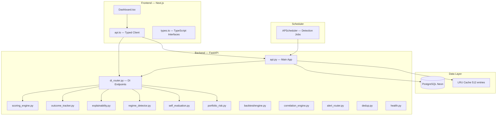
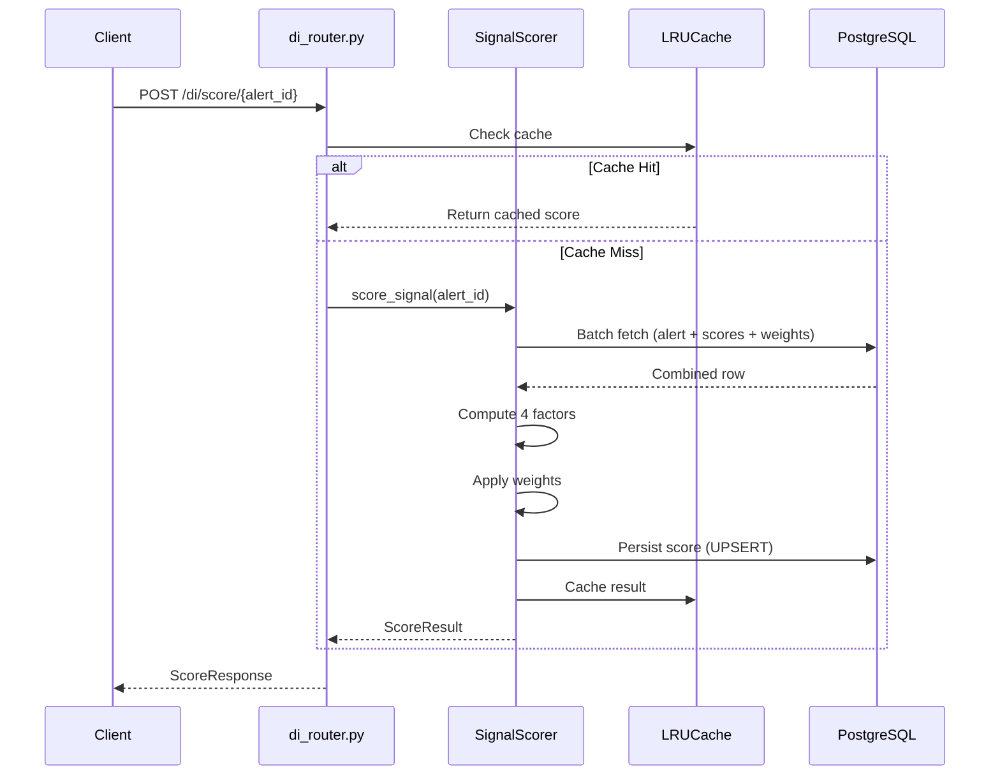
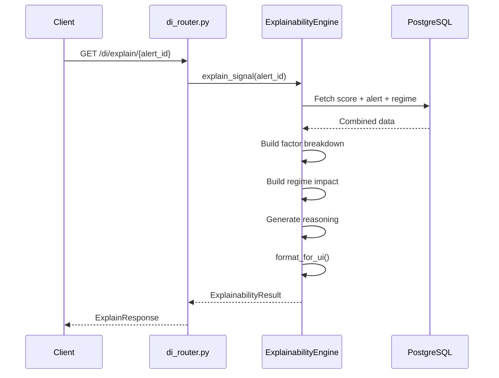
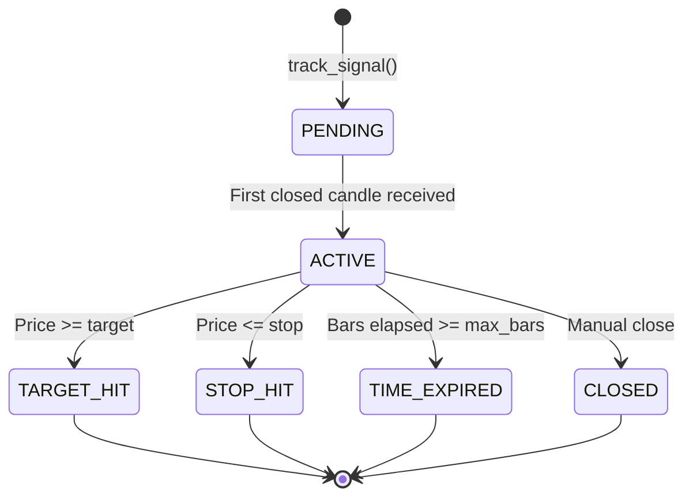
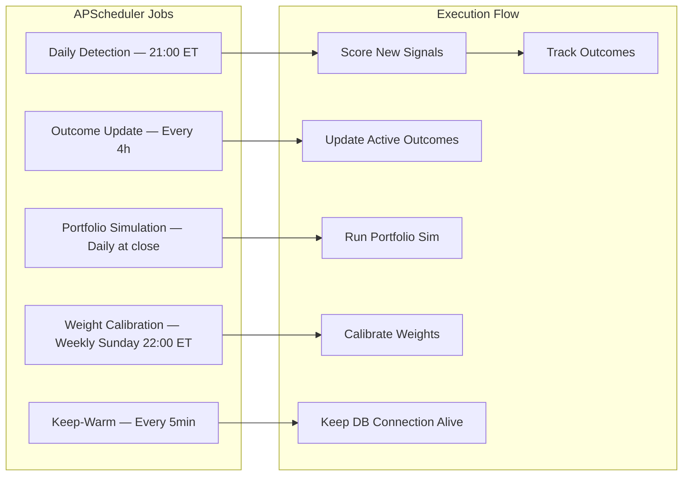
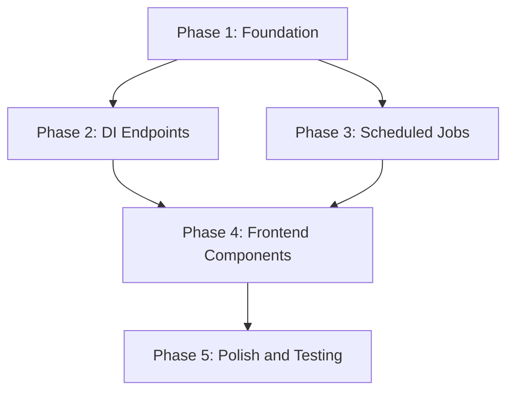

# Vigil Decision Intelligence Platform — Implementation Plan

**Version:** 1.0.0  
**Date:** 2026-04-03  
**Author:** Principal Software Architect  
**Status:** Draft — Pending Review

---

## Table of Contents

1. [Executive Summary](#1-executive-summary)
2. [Current System State](#2-current-system-state)
3. [Feature Implementation Plan](#3-feature-implementation-plan)
4. [Database Schema Modifications](#4-database-schema-modifications)
5. [Backend Architecture](#5-backend-architecture)
6. [API Contract Specifications](#6-api-contract-specifications)
7. [Frontend Component Architecture](#7-frontend-component-architecture)
8. [UX and Interaction Design](#8-ux-and-interaction-design)
9. [Engineering Decisions](#9-engineering-decisions)
10. [System Capabilities Matrix](#10-system-capabilities-matrix)
11. [Explicit Limitations Register](#11-explicit-limitations-register)
12. [README and Documentation Structure](#12-readme-and-documentation-structure)
13. [System Impact Analysis](#13-system-impact-analysis)
14. [Implementation Phases](#14-implementation-phases)

---

## 1. Executive Summary

Vigil is a Python-based trading intelligence platform built on FastAPI, PostgreSQL (Neon serverless), APScheduler, and Next.js. The platform already implements a substantial Decision Intelligence (DI) foundation including:

- **Signal Scoring Engine** ([`scoring_engine.py`](backend/services/scoring_engine.py:1)) — 0-100 weighted multi-factor scoring
- **Outcome Tracker** ([`outcome_tracker.py`](backend/services/outcome_tracker.py:1)) — State machine for post-signal tracking
- **Explainability Engine** ([`explainability.py`](backend/services/explainability.py:1)) — Machine-parseable rationales
- **Regime Detector** ([`regime_detector.py`](backend/services/regime_detector.py:1)) — Multi-vector market regime detection
- **Self-Evaluator** ([`self_evaluation.py`](backend/services/self_evaluation.py:1)) — Cohort analysis and weight adaptation
- **Portfolio Risk Analyzer** ([`portfolio_risk.py`](backend/services/portfolio_risk.py:1)) — VaR, CVaR, Kelly sizing
- **DI Router** ([`di_router.py`](backend/services/di_router.py:1)) — 11 REST endpoints for DI services

This plan elevates Vigil from a functional DI prototype to an **institutional-grade decision intelligence platform** by addressing:

1. **Data and query optimization** — Keyset pagination, composite indexes, N+1 elimination
2. **API standardization** — Pydantic v2 models, OpenAPI documentation, cursor pagination
3. **Frontend DI components** — Score cards, outcome trackers, explainability panels, equity curves
4. **Portfolio simulation** — Walk-forward simulation endpoint integrated into polling cycles
5. **Adaptive weight calibration** — Scheduled weight updates within polling cycles
6. **Production UX polish** — Professional trading tool standards, loading/error/empty states
7. **Engineering documentation** — Capabilities matrix, limitations register, polling trade-offs

**Architectural Constraints:**
- Polling-based execution model ONLY (no WebSockets, daemons, background queues)
- Free-tier hosting compatible (memory, CPU, connection pool limits)
- Preserve all existing functionality without regressions
- Modular architecture, strict type safety, comprehensive test coverage

---

## 2. Current System State

### 2.1 Architecture Overview



### 2.2 Existing Capabilities Inventory

| Component | File | Status | Capability |
|-----------|------|--------|------------|
| Signal Scorer | [`scoring_engine.py`](backend/services/scoring_engine.py:50) | **Implemented** | 4-factor scoring (hit_rate, regime_alignment, volatility, confluence), weight calibration via coordinate descent, LRU cache integration |
| Outcome Tracker | [`outcome_tracker.py`](backend/services/outcome_tracker.py:43) | **Implemented** | State machine (PENDING → ACTIVE → terminal), MAE/MFE tracking, max bars expiry (20), batch update from closed candles |
| Explainability | [`explainability.py`](backend/services/explainability.py:36) | **Implemented** | Trigger conditions, factor weights, regime impact, human-readable reasoning, UI formatting with grades (A-F) |
| Regime Detector | [`regime_detector.py`](backend/services/regime_detector.py:53) | **Implemented** | Trend slope, momentum strength, volatility percentile, breadth score, regime alignment scoring, DB cache with 300s TTL |
| Self-Evaluator | [`self_evaluation.py`](backend/services/self_evaluation.py:58) | **Implemented** | Cohort analysis by (signal_type, regime), decay half-life estimation, feature importance via Pearson correlation, weight adaptation |
| Portfolio Risk | [`portfolio_risk.py`](backend/services/portfolio_risk.py:236) | **Implemented** | VaR, CVaR, beta, Sharpe, max drawdown, Kelly-fractioned position sizing, correlation filter, drawdown cap |
| DI Router | [`di_router.py`](backend/services/di_router.py:1) | **Implemented** | 11 endpoints: score, outcomes, regime, evaluate, explain, simulate, cache stats |
| Backtest Engine | [`engine.py`](backend/backtest/engine.py:50) | **Implemented** | Event-driven backtesting, simulated broker, slippage/commission, Kelly-inspired position sizing |
| Backtest Metrics | [`metrics.py`](backend/backtest/metrics.py:33) | **Implemented** | Sharpe, Sortino, Calmar, profit factor, win rate, max drawdown, avg hold days |
| Correlation Engine | [`correlation_engine.py`](backend/services/correlation_engine.py:37) | **Implemented** | Rolling correlation matrix, stability scoring, hierarchical clustering, portfolio correlation stats |
| Alert Router | [`alert_router.py`](backend/services/alert_router.py:21) | **Implemented** | Multi-channel dispatch with exponential backoff retry (3 attempts), delivery recording |
| Dedup Store | [`dedup.py`](backend/services/dedup.py:7) | **Implemented** | In-memory + DB deduplication with SHA-256 fingerprints, 24h TTL |
| Health Checks | [`health.py`](backend/services/health.py:1) | **Implemented** | Comprehensive health (DB, scheduler, memory, disk), readiness, liveness, Prometheus metrics |
| Main API | [`api.py`](backend/api.py:1) | **Implemented** | FastAPI app with APScheduler, WebSocket (disabled), distributed lock wrapper, decay profiles |
| Database | [`database.py`](backend/database.py:1) | **Implemented** | Dual-pool (asyncpg + psycopg2), Neon optimizations, retry logic, 10+ tables |
| Frontend Dashboard | [`Dashboard.tsx`](frontend/components/Dashboard.tsx:17) | **Implemented** | Polling (15s alerts, 60s metrics), incremental polling, loading/error/empty states, two-column layout |
| API Client | [`api.ts`](frontend/lib/api.ts:37) | **Implemented** | Typed fetch wrapper, 10s timeout, exponential backoff retry (3 retries), DI endpoint functions |
| TypeScript Types | [`types.ts`](frontend/lib/types.ts:1) | **Implemented** | 15+ DI interfaces matching Pydantic models |

### 2.3 Existing Database Schema

**Migration 001** ([`001_neon_optimizations.sql`](backend/migrations/001_neon_optimizations.sql:1)):
- `alerts` table: 31+ columns (id, ticker, date, volume_ratio, change_pct, signal_type, state, edge_score, regime, trap_score, created_at, etc.)
- `watchlist` table
- `alert_deliveries` table
- `alert_dedup` table
- `backtest_runs`, `backtest_results`, `backtest_metrics` tables
- `correlation_matrix` table

**Migration 002** ([`002_decision_intelligence.sql`](backend/migrations/002_decision_intelligence.sql:1)):
- `signal_scores` table — Stores computed scores with version tracking
- `signal_outcomes` table — State machine with MAE/MFE tracking
- `regime_cache` table — Cached regime vectors with 300s TTL
- `weight_calibrations` table — Historical weight versions
- `evaluation_cohorts` table — Cohort analysis results

### 2.4 Identified Gaps

| Gap Area | Severity | Description |
|----------|----------|-------------|
| No cursor pagination | **High** | All queries use offset-based pagination; no keyset pagination for large datasets |
| No standardized error format | **Medium** | Error responses are inconsistent across endpoints |
| No OpenAPI documentation | **Medium** | Pydantic models exist but no generated OpenAPI spec or Swagger UI customization |
| Missing frontend DI components | **High** | No ScoreCard, OutcomeTracker, ExplainPanel, RegimeDashboard, EquityCurve components |
| No signal detail page | **High** | No dedicated route for individual signal analysis |
| No equity curve visualization | **Medium** | Backtest equity curve computed but not exposed to frontend |
| No confidence-tier distribution | **Medium** | Score grades (A-F) computed but not displayed as distribution |
| No walk-forward simulation endpoint | **Medium** | Portfolio simulation exists but not integrated into polling cycles |
| Weight calibration on-demand only | **Medium** | Self-evaluation runs manually, not scheduled within polling cycles |
| No N+1 query prevention documented | **Medium** | Multiple sequential DB calls in scoring/outcome update paths |
| Missing composite indexes on alerts | **Medium** | No indexes for DI-specific queries (signal_type + regime + created_at) |
| Legacy psycopg2 pool still active | **Low** | Many functions still use sync pool; deprecation warnings emitted |
| No explicit rate limiting on DI endpoints | **Low** | Rate limiter exists but not applied to `/di/*` routes |

---

## 3. Feature Implementation Plan

### 3.1 Signal Scoring and Ranking Engine

**Current State:** [`SignalScorer`](backend/services/scoring_engine.py:50) implements 4-factor weighted scoring with coordinate descent calibration.

**Enhancements Required:**

1. **Add score ranking endpoint** — `GET /di/scores/rankings?regime={regime}&limit=50`
   - Returns signals ranked by composite score within a regime
   - Uses keyset pagination (cursor-based on `score DESC, id DESC`)
   - Cached in LRU with 60s TTL

2. **Add score distribution endpoint** — `GET /di/scores/distribution`
   - Returns count of signals by grade tier (A, B, C, D, F)
   - Computed from last 100 scored signals
   - Used for frontend confidence-tier distribution display

3. **Add score history endpoint** — `GET /di/scores/{alert_id}/history`
   - Returns time series of score changes for a signal
   - Useful for tracking score decay over time

**Files Modified:**
- [`backend/services/di_router.py`](backend/services/di_router.py:1) — Add 3 new endpoints
- [`backend/services/scoring_engine.py`](backend/services/scoring_engine.py:1) — Add `get_rankings()`, `get_distribution()`, `get_score_history()` methods
- [`frontend/lib/api.ts`](frontend/lib/api.ts:1) — Add client functions
- [`frontend/lib/types.ts`](frontend/lib/types.ts:1) — Add TypeScript interfaces

### 3.2 Structured Explanation Engine

**Current State:** [`ExplainabilityEngine`](backend/services/explainability.py:36) produces trigger conditions, factor weights, regime impact, and human-readable reasoning.

**Enhancements Required:**

1. **Add machine-parseable output format** — `GET /di/explain/{alert_id}?format=machine`
   - Returns JSON with structured factor breakdowns
   - Each factor includes: name, weight, value, contribution, confidence
   - Used by algorithmic consumers (external systems, automated routing)

2. **Add batch explanation endpoint** — `POST /di/explain/batch`
   - Accepts list of alert_ids, returns explanations in single request
   - Reduces N+1 API calls from frontend
   - Max 50 alert_ids per request

**Files Modified:**
- [`backend/services/di_router.py`](backend/services/di_router.py:1) — Add 2 new endpoints
- [`backend/services/explainability.py`](backend/services/explainability.py:1) — Add `explain_batch()` method, `format_for_machine()` static method
- [`frontend/lib/api.ts`](frontend/lib/api.ts:1) — Add `fetchExplainabilityBatch()`
- [`frontend/lib/types.ts`](frontend/lib/types.ts:1) — Add `MachineExplainResponse`, `BatchExplainResponse`

### 3.3 Deterministic Outcome Tracking System

**Current State:** [`OutcomeTracker`](backend/services/outcome_tracker.py:43) implements state machine with MAE/MFE tracking.

**Enhancements Required:**

1. **Add outcome statistics endpoint** — `GET /di/outcomes/stats?signal_type={type}&regime={regime}`
   - Returns win rate, avg PnL, avg hold bars, max drawdown for cohort
   - Grouped by (signal_type, regime) for performance attribution
   - Cached with 300s TTL

2. **Add outcome timeline endpoint** — `GET /di/outcomes/{signal_id}/timeline`
   - Returns state transition history with timestamps
   - Includes MAE/MFE at each bar
   - Used for frontend outcome visualization

3. **Add outcome evaluation to polling cycle** — Schedule `update_outcomes()` as APScheduler job
   - Runs every 4 hours during market hours
   - Uses closed candle data from `data.py`
   - Updates all active outcomes in batch

**Files Modified:**
- [`backend/services/di_router.py`](backend/services/di_router.py:1) — Add 2 new endpoints
- [`backend/services/outcome_tracker.py`](backend/services/outcome_tracker.py:1) — Add `get_stats()`, `get_timeline()` methods
- [`backend/api.py`](backend/api.py:154) — Add scheduled job for outcome updates
- [`frontend/lib/api.ts`](frontend/lib/api.ts:1) — Add client functions
- [`frontend/lib/types.ts`](frontend/lib/types.ts:1) — Add `OutcomeStats`, `OutcomeTimeline` interfaces

### 3.4 Institutional Performance Dashboard

**Current State:** [`Dashboard.tsx`](frontend/components/Dashboard.tsx:17) shows alert cards and metrics panel.

**Enhancements Required:**

1. **New Components:**
   - `ScoreCard.tsx` — Displays composite score, grade, factor breakdown, progress bars
   - `OutcomeTracker.tsx` — Shows active outcomes with state, MAE/MFE, time remaining
   - `ExplainPanel.tsx` — Renders explainability breakdown with color-coded factors
   - `RegimeDashboard.tsx` — Displays current regime vector with trend/momentum/volatility/breadth
   - `EquityCurve.tsx` — Recharts-based equity curve visualization
   - `ConfidenceDistribution.tsx` — Bar chart of score grade distribution (A-F)
   - `SignalDetail.tsx` — Full signal detail page with all DI data
   - `PerformanceMetrics.tsx` — Win rate, Sharpe, profit factor, max drawdown cards

2. **New Pages:**
   - `/signals/{id}` — Signal detail page with score, explanation, outcome, regime
   - `/dashboard` — Enhanced dashboard with DI components
   - `/regime` — Regime analysis page
   - `/performance` — Performance attribution page

3. **Data Fetching:**
   - Use React Query patterns for caching and background refetching
   - Stale time: 30s for scores, 60s for outcomes, 300s for regime
   - Retry: 3 attempts with exponential backoff (existing pattern in [`api.ts`](frontend/lib/api.ts:80))

**Files Created:**
- `frontend/components/ScoreCard.tsx`
- `frontend/components/OutcomeTracker.tsx`
- `frontend/components/ExplainPanel.tsx`
- `frontend/components/RegimeDashboard.tsx`
- `frontend/components/EquityCurve.tsx`
- `frontend/components/ConfidenceDistribution.tsx`
- `frontend/components/SignalDetail.tsx`
- `frontend/components/PerformanceMetrics.tsx`
- `frontend/app/signals/[id]/page.tsx`
- `frontend/app/dashboard/page.tsx`
- `frontend/app/regime/page.tsx`
- `frontend/app/performance/page.tsx`

### 3.5 Signal Detail Interface

**Current State:** No dedicated signal detail page.

**Design:**

```
/signals/{id}
├── Header: Ticker, Signal Type, Date, Edge Score
├── ScoreCard: Composite score (0-100), Grade (A-F), factor breakdown
├── ExplainPanel: Trigger conditions, factor weights, regime impact, reasoning
├── OutcomeTracker: Current state, MAE/MFE, bars elapsed, target/stop levels
├── RegimeContext: Current regime vector, alignment score
└── ActionButtons: Score, Track, Explain (manual trigger)
```

**Data Flow:**
1. Page loads → `GET /di/score/{id}` + `GET /di/explain/{id}` + `GET /di/outcomes/{id}`
2. Parallel fetches with `Promise.all()`
3. Loading skeleton displayed until all data arrives
4. Error boundary catches individual fetch failures

### 3.6 Data and Query Optimization

**Keyset Pagination Implementation:**

```sql
-- Replace offset-based pagination with keyset pagination
-- Before: SELECT * FROM alerts ORDER BY created_at DESC LIMIT 50 OFFSET 0
-- After:  SELECT * FROM alerts WHERE (created_at, id) < ($1, $2) ORDER BY created_at DESC, id DESC LIMIT 50
```

**New Composite Indexes:**

```sql
-- For DI score lookups
CREATE INDEX CONCURRENTLY idx_alerts_signal_type_regime_created
    ON alerts (signal_type, regime, created_at DESC);

-- For outcome tracking queries
CREATE INDEX CONCURRENTLY idx_outcomes_state_signal_type
    ON signal_outcomes (state, signal_type) WHERE state != 'CLOSED';

-- For score ranking queries
CREATE INDEX CONCURRENTLY idx_signal_scores_score_regime
    ON signal_scores (score DESC, regime) WHERE score IS NOT NULL;

-- For alert deduplication queries
CREATE INDEX CONCURRENTLY idx_alerts_ticker_signal_date
    ON alerts (ticker, signal_type, date DESC);
```

**N+1 Query Elimination:**

In [`scoring_engine.py`](backend/services/scoring_engine.py:73), the `score_signal()` method makes sequential calls:
1. `_fetch_alert()` → 1 query
2. `_fetch_historical_outcomes()` → 1 query
3. `_get_weights()` → 1 query

**Optimization:** Batch these into a single JOIN query:

```sql
SELECT a.*, ss.score, ss.version, wc.weights
FROM alerts a
LEFT JOIN signal_scores ss ON a.id = ss.alert_id
LEFT JOIN weight_calibrations wc ON ss.weight_version = wc.version
WHERE a.id = $1;
```

**Files Modified:**
- [`backend/database.py`](backend/database.py:485) — Add `get_alerts_keyset()` function
- [`backend/services/scoring_engine.py`](backend/services/scoring_engine.py:73) — Add batched fetch method
- [`backend/services/di_router.py`](backend/services/di_router.py:1) — Add cursor pagination to list endpoints
- [`backend/migrations/003_query_optimizations.sql`](backend/migrations/003_query_optimizations.sql) — New migration file

### 3.7 Frontend State Integrity

**Current State:** [`Dashboard.tsx`](frontend/components/Dashboard.tsx:17) has basic loading/error/empty states.

**Enhancements Required:**

1. **Standardized Loading States:**
   - Skeleton loaders for all data cards
   - Progressive loading (metrics first, then signals)
   - Stale data indicator when polling is delayed

2. **Standardized Error States:**
   - Error boundary wrapper for each component
   - Retry button with countdown timer
   - Error toast for network failures
   - Graceful degradation when DI services unavailable

3. **Standardized Empty States:**
   - "No signals found" with date range selector
   - "No active outcomes" with link to historical outcomes
   - "Regime data unavailable" with manual trigger button

4. **Polling Health Indicator:**
   - Visual indicator showing last successful poll time
   - Auto-reconnect when connection restored
   - Manual refresh button

**Files Modified:**
- [`frontend/components/Dashboard.tsx`](frontend/components/Dashboard.tsx:1) — Add polling health indicator
- `frontend/components/ErrorBoundary.tsx` — New component
- `frontend/components/SkeletonLoader.tsx` — New component
- `frontend/components/EmptyState.tsx` — New component
- `frontend/lib/api.ts`](frontend/lib/api.ts:1) — Add polling health tracking

### 3.8 API Standardization

**Standardized Error Response:**

```python
class ErrorResponse(BaseModel):
    error: str
    message: str
    code: str  # Machine-readable error code
    details: Optional[dict] = None
    timestamp: str
    request_id: Optional[str] = None
```

**Error Codes:**
- `SIGNAL_NOT_FOUND` — Alert ID does not exist
- `SCORE_NOT_AVAILABLE` — Score not yet computed
- `OUTCOME_NOT_TRACKED` — Outcome not yet created
- `REGIME_STALE` — Regime cache expired
- `RATE_LIMITED` — Too many requests
- `INTERNAL_ERROR` — Unexpected server error

**Cursor Pagination Response:**

```python
class PaginatedResponse(BaseModel, Generic[T]):
    data: list[T]
    pagination: PaginationInfo

class PaginationInfo(BaseModel):
    next_cursor: Optional[str] = None
    prev_cursor: Optional[str] = None
    total_count: Optional[int] = None  # Only if explicitly requested
    has_more: bool
```

**Cursor Encoding:**
- Base64-encoded JSON: `{"id": 12345, "created_at": "2026-04-03T12:00:00"}`
- Decoded by backend to construct WHERE clause

**Files Modified:**
- [`backend/services/di_router.py`](backend/services/di_router.py:1) — Add ErrorResponse, PaginatedResponse models
- [`backend/api.py`](backend/api.py:1) — Add global exception handler
- [`frontend/lib/api.ts`](frontend/lib/api.ts:1) — Add cursor pagination support
- [`frontend/lib/types.ts`](frontend/lib/types.ts:1) — Add `ErrorResponse`, `PaginatedResponse` interfaces

### 3.9 Portfolio Simulation Engine

**Current State:** [`PortfolioSimulator`](backend/services/portfolio_risk.py:236) implements Kelly-fractioned position sizing with correlation filter.

**Enhancements Required:**

1. **Add walk-forward simulation endpoint** — `POST /di/simulate/walkforward`
   - Runs simulation over rolling windows (e.g., 30-day windows, 7-day step)
   - Returns equity curve, drawdown series, win rate per window
   - Used for strategy robustness assessment

2. **Add simulation to polling cycle** — Schedule `simulate_portfolio()` as APScheduler job
   - Runs daily at market close
   - Uses latest scored signals and outcome data
   - Persists results to new `simulation_results` table

3. **Add simulation history endpoint** — `GET /di/simulate/history`
   - Returns historical simulation results
   - Used for frontend equity curve visualization

**Files Modified:**
- [`backend/services/di_router.py`](backend/services/di_router.py:1) — Add 3 new endpoints
- [`backend/services/portfolio_risk.py`](backend/services/portfolio_risk.py:1) — Add `walk_forward_simulation()` method
- [`backend/api.py`](backend/api.py:154) — Add scheduled job for daily simulation
- [`backend/migrations/004_simulation_results.sql`](backend/migrations/004_simulation_results.sql) — New migration
- [`frontend/lib/api.ts`](frontend/lib/api.ts:1) — Add client functions
- [`frontend/lib/types.ts`](frontend/lib/types.ts:1) — Add `WalkForwardResult`, `SimulationHistoryItem` interfaces

### 3.10 Adaptive Weight Calibration

**Current State:** [`SelfEvaluator`](backend/services/self_evaluation.py:58) implements cohort analysis and weight adaptation, but runs on-demand.

**Enhancements Required:**

1. **Schedule weight calibration in polling cycle** — Add APScheduler job
   - Runs weekly (Sunday 22:00 ET)
   - Uses last 90 days of outcome data
   - Updates weights via coordinate descent
   - Persists new weights to `weight_calibrations` table

2. **Add weight history endpoint** — `GET /di/weights/history`
   - Returns historical weight versions with timestamps
   - Shows weight evolution over time
   - Used for frontend weight tracking

3. **Add weight recommendation endpoint** — `GET /di/weights/recommendation`
   - Returns recommended weights based on latest cohort analysis
   - Does NOT apply weights — only suggests
   - Requires manual approval via `POST /di/weights/apply`

**Files Modified:**
- [`backend/services/di_router.py`](backend/services/di_router.py:1) — Add 3 new endpoints
- [`backend/services/self_evaluation.py`](backend/services/self_evaluation.py:1) — Add `get_weight_history()`, `get_recommendation()` methods
- [`backend/api.py`](backend/api.py:154) — Add scheduled job for weekly weight calibration
- [`frontend/lib/api.ts`](frontend/lib/api.ts:1) — Add client functions
- [`frontend/lib/types.ts`](frontend/lib/types.ts:1) — Add `WeightHistoryItem`, `WeightRecommendation` interfaces

### 3.11 Production UX Polish

**Standards:**

1. **Typography:**
   - Monospace font for all numeric values (scores, PnL, percentages)
   - Consistent decimal places: scores (0), percentages (1), PnL (2)

2. **Color System:**
   - Score grades: A (green-400), B (green-300), C (yellow-400), D (orange-400), F (red-400)
   - Regime: TRENDING (blue-400), SIDEWAYS (gray-400), VOLATILE (red-400)
   - Outcome states: PENDING (gray-400), ACTIVE (blue-400), TARGET_HIT (green-400), STOP_HIT (red-400), TIME_EXPIRED (orange-400), CLOSED (gray-500)

3. **Layout:**
   - Max width: 1440px
   - Card-based layout with consistent padding (p-4)
   - Responsive breakpoints: sm (640px), md (768px), lg (1024px), xl (1280px)

4. **Interactions:**
   - Hover states on all interactive elements
   - Click-to-copy for ticker symbols
   - Keyboard shortcuts: R (refresh), S (sort), F (filter)

**Files Modified:**
- `frontend/components/ScoreCard.tsx` — New component
- `frontend/components/OutcomeTracker.tsx` — New component
- `frontend/components/ExplainPanel.tsx` — New component
- `frontend/app/globals.css` — Add monospace font, color variables
- `frontend/tailwind.config.ts` — Add custom color palette

---

## 4. Database Schema Modifications

### 4.1 Migration 003: Query Optimizations

**File:** `backend/migrations/003_query_optimizations.sql`

```sql
-- Migration 003: Query Optimizations
-- Purpose: Add composite indexes and keyset pagination support

-- Composite indexes for DI queries
CREATE INDEX CONCURRENTLY IF NOT EXISTS idx_alerts_signal_type_regime_created
    ON alerts (signal_type, regime, created_at DESC);

CREATE INDEX CONCURRENTLY IF NOT EXISTS idx_alerts_ticker_signal_date
    ON alerts (ticker, signal_type, date DESC);

CREATE INDEX CONCURRENTLY IF NOT EXISTS idx_signal_scores_score_regime
    ON signal_scores (score DESC, regime) WHERE score IS NOT NULL;

CREATE INDEX CONCURRENTLY IF NOT EXISTS idx_outcomes_state_signal_type
    ON signal_outcomes (state, signal_type) WHERE state != 'CLOSED';

-- Covering index for score lookups (avoids table scan)
CREATE INDEX CONCURRENTLY IF NOT EXISTS idx_signal_scores_alert_score_version
    ON signal_scores (alert_id, score, version) INCLUDE (computed_at);

-- Index for outcome timeline queries
CREATE INDEX CONCURRENTLY IF NOT EXISTS idx_outcomes_signal_updated
    ON signal_outcomes (signal_id, updated_at DESC);

-- Index for regime cache lookups
CREATE INDEX CONCURRENTLY IF NOT EXISTS idx_regime_cache_symbol_tf_expires
    ON regime_cache (symbol, timeframe, expires_at DESC);
```

### 4.2 Migration 004: Simulation Results

**File:** `backend/migrations/004_simulation_results.sql`

```sql
-- Migration 004: Simulation Results
-- Purpose: Store historical portfolio simulation results

CREATE TABLE IF NOT EXISTS simulation_results (
    id SERIAL PRIMARY KEY,
    run_at TIMESTAMPTZ NOT NULL DEFAULT NOW(),
    simulation_type VARCHAR(32) NOT NULL,  -- 'kelly', 'half_kelly', 'fixed'
    account_size DECIMAL(15, 2) NOT NULL,
    total_return_pct DECIMAL(8, 2),
    max_drawdown_pct DECIMAL(8, 2),
    sharpe_ratio DECIMAL(8, 4),
    win_rate DECIMAL(5, 2),
    total_trades INT,
    equity_curve JSONB,  -- [{date, equity, cash, positions}]
    positions JSONB,     -- [{ticker, size, score, entry_price}]
    config JSONB,        -- Simulation parameters used
    created_at TIMESTAMPTZ NOT NULL DEFAULT NOW()
);

CREATE INDEX CONCURRENTLY IF NOT EXISTS idx_simulation_results_run_at
    ON simulation_results (run_at DESC);

CREATE INDEX CONCURRENTLY IF NOT EXISTS idx_simulation_results_type
    ON simulation_results (simulation_type);
```

### 4.3 Migration 005: Weight History Tracking

**File:** `backend/migrations/005_weight_history.sql`

```sql
-- Migration 005: Weight History Tracking
-- Purpose: Track weight evolution and recommendations

ALTER TABLE weight_calibrations
    ADD COLUMN IF NOT EXISTS applied BOOLEAN DEFAULT FALSE,
    ADD COLUMN IF NOT EXISTS recommended_at TIMESTAMPTZ,
    ADD COLUMN IF NOT EXISTS applied_at TIMESTAMPTZ;

CREATE INDEX CONCURRENTLY IF NOT EXISTS idx_weight_calibrations_applied
    ON weight_calibrations (applied, version DESC);

-- Add cohort_id to evaluation_cohorts for linking
ALTER TABLE evaluation_cohorts
    ADD COLUMN IF NOT EXISTS cohort_id UUID DEFAULT gen_random_uuid();

CREATE INDEX CONCURRENTLY IF NOT EXISTS idx_evaluation_cohorts_cohort_id
    ON evaluation_cohorts (cohort_id);
```

### 4.4 Index Strategy Summary

| Index | Table | Columns | Purpose | Type |
|-------|-------|---------|---------|------|
| `idx_alerts_signal_type_regime_created` | alerts | signal_type, regime, created_at DESC | DI score ranking by regime | Composite B-tree |
| `idx_alerts_ticker_signal_date` | alerts | ticker, signal_type, date DESC | Dedup and recent alert lookup | Composite B-tree |
| `idx_signal_scores_score_regime` | signal_scores | score DESC, regime WHERE score IS NOT NULL | Score distribution queries | Partial composite |
| `idx_outcomes_state_signal_type` | signal_outcomes | state, signal_type WHERE state != 'CLOSED' | Active outcome queries | Partial composite |
| `idx_signal_scores_alert_score_version` | signal_scores | alert_id, score, version INCLUDE (computed_at) | Score lookup with covering index | Covering B-tree |
| `idx_outcomes_signal_updated` | signal_outcomes | signal_id, updated_at DESC | Outcome timeline queries | Composite B-tree |
| `idx_regime_cache_symbol_tf_expires` | regime_cache | symbol, timeframe, expires_at DESC | Regime cache lookup | Composite B-tree |
| `idx_simulation_results_run_at` | simulation_results | run_at DESC | Simulation history queries | B-tree |
| `idx_simulation_results_type` | simulation_results | simulation_type | Filter by simulation type | B-tree |
| `idx_weight_calibrations_applied` | weight_calibrations | applied, version DESC | Find latest applied weights | Composite B-tree |
| `idx_evaluation_cohorts_cohort_id` | evaluation_cohorts | cohort_id | Group cohort results | B-tree |

---

## 5. Backend Architecture

### 5.1 Scoring Logic Architecture



**Key Design Decisions:**
- **Batched DB fetch** — Single JOIN query replaces 3 sequential queries
- **LRU cache** — 512 entries, 300s TTL, key = `score:{alert_id}`
- **Idempotent scoring** — `ON CONFLICT DO UPDATE` ensures re-scoring is safe
- **Weight versioning** — Each score records which weight version was used

### 5.2 Explanation Generation Architecture



**Key Design Decisions:**
- **Dual format output** — `format_for_ui()` for frontend, `format_for_machine()` for API consumers
- **Batch endpoint** — `POST /di/explain/batch` reduces N+1 calls
- **Graceful degradation** — Missing regime data does not block explanation

### 5.3 Outcome State Management



**State Transition Logic:**

| From State | Trigger | To State | Conditions |
|------------|---------|----------|------------|
| PENDING | Closed candle data | ACTIVE | Candle close price available |
| ACTIVE | Price movement | TARGET_HIT | `high >= target_price` |
| ACTIVE | Price movement | STOP_HIT | `low <= stop_price` |
| ACTIVE | Bar count | TIME_EXPIRED | `bars_elapsed >= max_bars` (default 20) |
| ACTIVE | Manual action | CLOSED | Explicit close request |

**MAE/MFE Tracking:**
- MAE (Maximum Adverse Excursion): Lowest price reached during position
- MFE (Maximum Favorable Excursion): Highest price reached during position
- Updated on every `_update_single_outcome()` call

### 5.4 Polling Cycle Integration



**Job Schedule:**

| Job | Schedule | Function | Lock Key | TTL |
|-----|----------|----------|----------|-----|
| Daily Detection | Cron 21:00 ET Mon-Fri | `trigger_detection()` | `daily_detection` | 3600s |
| Outcome Update | Interval 4h | `update_outcomes()` | `outcome_update` | 1800s |
| Portfolio Simulation | Cron 16:30 ET Mon-Fri | `simulate_portfolio()` | `portfolio_sim` | 900s |
| Weight Calibration | Cron 22:00 ET Sunday | `run_cohort_analysis()` | `weight_calibrate` | 3600s |
| Keep-Warm | Interval 5min | `_get_system_stats()` | `keep_warm` | 60s |

### 5.5 N+1 Query Prevention

**Problem:** Current scoring path makes 3 sequential DB calls per signal.

**Solution:** Batch fetch with JOIN query.

```python
# Before: 3 sequential queries
alert = await _fetch_alert(alert_id)        # Query 1
outcomes = await _fetch_historical_outcomes(alert_id)  # Query 2
weights = await _get_weights()              # Query 3

# After: 1 batched query
async def _fetch_scoring_context(self, alert_id: int) -> Optional[dict]:
    query = """
        SELECT
            a.*,
            ss.score as latest_score,
            ss.version as score_version,
            ss.computed_at as score_computed_at,
            wc.weights as current_weights,
            wc.version as weight_version
        FROM alerts a
        LEFT JOIN signal_scores ss ON a.id = ss.alert_id
            AND ss.computed_at = (
                SELECT MAX(computed_at) FROM signal_scores WHERE alert_id = a.id
            )
        LEFT JOIN weight_calibrations wc ON wc.applied = true
            AND wc.version = (
                SELECT MAX(version) FROM weight_calibrations WHERE applied = true
            )
        WHERE a.id = $1
    """
    async with self._pool.acquire() as conn:
        row = await conn.fetchrow(query, alert_id)
        return dict(row) if row else None
```

**Impact:** Reduces DB round-trips from 3 to 1 per signal scoring operation.

---

## 6. API Contract Specifications

### 6.1 Standardized Error Response

```python
class ErrorResponse(BaseModel):
    """Standardized error response for all endpoints."""
    error: str           # Machine-readable error code
    message: str         # Human-readable description
    code: str            # Error code (e.g., "SIGNAL_NOT_FOUND")
    details: Optional[dict] = None  # Additional context
    timestamp: str       # ISO 8601 timestamp
    request_id: Optional[str] = None  # Correlation ID for debugging
```

**Error Code Registry:**

| Code | HTTP Status | Description |
|------|-------------|-------------|
| `SIGNAL_NOT_FOUND` | 404 | Alert ID does not exist |
| `SCORE_NOT_AVAILABLE` | 404 | Score not yet computed for this signal |
| `OUTCOME_NOT_TRACKED` | 404 | Outcome not yet created for this signal |
| `REGIME_STALE` | 404 | Regime cache has expired |
| `RATE_LIMITED` | 429 | Too many requests |
| `INVALID_CURSOR` | 400 | Cursor parameter is malformed |
| `BATCH_TOO_LARGE` | 400 | Batch request exceeds max size (50) |
| `INTERNAL_ERROR` | 500 | Unexpected server error |

### 6.2 Cursor Pagination

**Request Parameters:**

| Parameter | Type | Required | Description |
|-----------|------|----------|-------------|
| `cursor` | string | No | Base64-encoded cursor from previous response |
| `limit` | int | No | Items per page (default 50, max 200) |
| `sort` | string | No | Sort field (default: `created_at`) |
| `order` | string | No | Sort direction: `asc` or `desc` (default: `desc`) |

**Response Schema:**

```python
class PaginationInfo(BaseModel):
    next_cursor: Optional[str] = None
    prev_cursor: Optional[str] = None
    has_more: bool
    limit: int
    sort: str
    order: str

class PaginatedResponse(BaseModel, Generic[T]):
    data: list[T]
    pagination: PaginationInfo
```

**Cursor Encoding:**

```python
import base64
import json

def encode_cursor(id: int, sort_value: Any) -> str:
    payload = {"id": id, "sort_value": sort_value}
    return base64.b64encode(json.dumps(payload).encode()).decode()

def decode_cursor(cursor: str) -> dict:
    payload = json.loads(base64.b64decode(cursor.encode()).decode())
    return payload
```

### 6.3 Endpoint Specifications

#### `POST /di/score/{alert_id}`

**Request:**
- Path: `alert_id` (int, required)

**Response (200):**
```json
{
    "alert_id": 12345,
    "score": 78,
    "grade": "B",
    "factors": {
        "hit_rate": 0.30,
        "regime_alignment": 0.25,
        "volatility": 0.20,
        "confluence": 0.25
    },
    "factor_scores": {
        "hit_rate": 0.72,
        "regime_alignment": 0.85,
        "volatility": 0.65,
        "confluence": 0.80
    },
    "weight_version": "v3",
    "computed_at": "2026-04-03T12:00:00Z"
}
```

**Errors:**
- `404 SIGNAL_NOT_FOUND` — Alert ID does not exist
- `500 INTERNAL_ERROR` — Scoring engine failure

#### `GET /di/scores/rankings`

**Request:**
- Query: `regime` (string, optional) — Filter by regime
- Query: `cursor` (string, optional) — Pagination cursor
- Query: `limit` (int, optional, default 50) — Page size

**Response (200):**
```json
{
    "data": [
        {
            "alert_id": 12345,
            "ticker": "AAPL",
            "signal_type": "VOLUME_SPIKE_UP",
            "score": 85,
            "grade": "A",
            "regime": "TRENDING",
            "created_at": "2026-04-03T12:00:00Z"
        }
    ],
    "pagination": {
        "next_cursor": "eyJpZCI6MTIzNDUsInNvcnRfdmFsdWUiOiIyMDI2LTA0LTAzVDEyOjAwOjAwWiJ9",
        "prev_cursor": null,
        "has_more": true,
        "limit": 50,
        "sort": "score",
        "order": "desc"
    }
}
```

#### `GET /di/scores/distribution`

**Response (200):**
```json
{
    "total_scored": 150,
    "distribution": {
        "A": 12,
        "B": 35,
        "C": 48,
        "D": 30,
        "F": 25
    },
    "percentages": {
        "A": 8.0,
        "B": 23.3,
        "C": 32.0,
        "D": 20.0,
        "F": 16.7
    }
}
```

#### `GET /di/explain/{alert_id}`

**Request:**
- Path: `alert_id` (int, required)
- Query: `format` (string, optional, default "ui") — "ui" or "machine"

**Response (200) — UI Format:**
```json
{
    "alert_id": 12345,
    "score": 78,
    "grade": "B",
    "grade_label": "Good",
    "grade_color": "green-300",
    "trigger_conditions": [
        "Volume spike detected: 3.2x average",
        "Price momentum: +5.4% in 5 days"
    ],
    "factor_breakdown": [
        {
            "name": "Hit Rate",
            "weight": 0.30,
            "score": 0.72,
            "contribution": 0.216,
            "label": "Above Average",
            "color": "green",
            "progress": 72
        }
    ],
    "regime_impact": {
        "current_regime": "TRENDING",
        "alignment": "Favorable",
        "adjustment": 0.15,
        "reasoning": "Trending regime favors directional signals"
    },
    "reasoning": "Strong volume spike with favorable regime alignment. Hit rate above average for this signal type.",
    "progress_bar": 78,
    "letter_grade": "B"
}
```

**Response (200) — Machine Format:**
```json
{
    "alert_id": 12345,
    "score": 78,
    "factors": [
        {
            "name": "hit_rate",
            "weight": 0.30,
            "value": 0.72,
            "contribution": 0.216,
            "confidence": 0.85
        }
    ],
    "regime": {
        "type": "TRENDING",
        "alignment_score": 0.85,
        "adjustment": 0.15
    },
    "metadata": {
        "weight_version": "v3",
        "computed_at": "2026-04-03T12:00:00Z"
    }
}
```

#### `POST /di/explain/batch`

**Request:**
```json
{
    "alert_ids": [12345, 12346, 12347]
}
```

**Response (200):**
```json
{
    "explanations": [
        { "alert_id": 12345, "score": 78, "grade": "B", ... },
        { "alert_id": 12346, "score": 65, "grade": "C", ... },
        { "alert_id": 12347, "error": "SCORE_NOT_AVAILABLE" }
    ],
    "total_requested": 3,
    "total_succeeded": 2,
    "total_failed": 1
}
```

**Errors:**
- `400 BATCH_TOO_LARGE` — More than 50 alert_ids

#### `GET /di/outcomes/stats`

**Request:**
- Query: `signal_type` (string, optional)
- Query: `regime` (string, optional)
- Query: `lookback_days` (int, optional, default 30)

**Response (200):**
```json
{
    "signal_type": "VOLUME_SPIKE_UP",
    "regime": "TRENDING",
    "lookback_days": 30,
    "total_signals": 45,
    "win_rate": 62.2,
    "avg_pnl_pct": 2.34,
    "avg_hold_bars": 8.5,
    "max_drawdown_pct": -4.2,
    "profit_factor": 1.85,
    "sharpe_ratio": 1.23
}
```

#### `GET /di/outcomes/{signal_id}/timeline`

**Response (200):**
```json
{
    "signal_id": 12345,
    "current_state": "ACTIVE",
    "transitions": [
        {
            "state": "PENDING",
            "timestamp": "2026-04-03T12:00:00Z",
            "mae": 0.0,
            "mfe": 0.0,
            "bars_elapsed": 0
        },
        {
            "state": "ACTIVE",
            "timestamp": "2026-04-03T16:00:00Z",
            "mae": -0.5,
            "mfe": 1.2,
            "bars_elapsed": 1
        }
    ],
    "target_price": 185.00,
    "stop_price": 175.00,
    "max_bars": 20,
    "bars_remaining": 15
}
```

#### `POST /di/simulate/walkforward`

**Request:**
```json
{
    "window_days": 30,
    "step_days": 7,
    "initial_capital": 100000,
    "kelly_fraction": 0.5,
    "max_position_pct": 10.0
}
```

**Response (200):**
```json
{
    "windows": [
        {
            "start_date": "2026-01-01",
            "end_date": "2026-01-30",
            "total_return_pct": 3.2,
            "max_drawdown_pct": -1.5,
            "win_rate": 65.0,
            "sharpe_ratio": 1.45,
            "trades": 23
        }
    ],
    "aggregate": {
        "avg_return_pct": 2.8,
        "avg_drawdown_pct": -1.8,
        "avg_win_rate": 62.5,
        "avg_sharpe": 1.32,
        "total_windows": 12,
        "positive_windows": 10
    }
}
```

#### `GET /di/weights/history`

**Response (200):**
```json
{
    "weights": [
        {
            "version": "v3",
            "hit_rate": 0.30,
            "regime_alignment": 0.25,
            "volatility": 0.20,
            "confluence": 0.25,
            "applied": true,
            "applied_at": "2026-04-01T22:00:00Z",
            "created_at": "2026-04-01T22:00:00Z"
        },
        {
            "version": "v2",
            "hit_rate": 0.25,
            "regime_alignment": 0.30,
            "volatility": 0.20,
            "confluence": 0.25,
            "applied": false,
            "applied_at": null,
            "created_at": "2026-03-25T22:00:00Z"
        }
    ]
}
```

#### `GET /di/weights/recommendation`

**Response (200):**
```json
{
    "recommended_weights": {
        "hit_rate": 0.35,
        "regime_alignment": 0.20,
        "volatility": 0.20,
        "confluence": 0.25
    },
    "current_weights": {
        "hit_rate": 0.30,
        "regime_alignment": 0.25,
        "volatility": 0.20,
        "confluence": 0.25
    },
    "rationale": "Hit rate weight increased due to 65% win rate in last 90 days",
    "cohort_size": 150,
    "analysis_period": "90 days"
}
```

#### `POST /di/weights/apply`

**Request:**
```json
{
    "version": "v4"
}
```

**Response (200):**
```json
{
    "status": "applied",
    "version": "v4",
    "applied_at": "2026-04-03T12:00:00Z"
}
```

### 6.4 Global Exception Handler

```python
@app.exception_handler(Exception)
async def global_exception_handler(request: Request, exc: Exception):
    request_id = str(uuid4())
    logger.error(f"Request {request_id} failed: {exc}", exc_info=True)

    if isinstance(exc, VigilError):
        status_code = exc.status_code
        error_code = exc.code
        message = exc.message
    else:
        status_code = 500
        error_code = "INTERNAL_ERROR"
        message = "An unexpected error occurred"

    return JSONResponse(
        status_code=status_code,
        content=ErrorResponse(
            error=error_code,
            message=message,
            code=error_code,
            timestamp=datetime.now(timezone.utc).isoformat(),
            request_id=request_id,
        ).model_dump(),
    )
```

---

## 7. Frontend Component Architecture

### 7.1 Component Hierarchy

```mermaid
graph TD
    APP[app/layout.tsx]
    DASH[app/dashboard/page.tsx]
    SIGNAL[app/signals/id/page.tsx]
    REGIME[app/regime/page.tsx]
    PERF[app/performance/page.tsx]

    APP --> DASH
    APP --> SIGNAL
    APP --> REGIME
    APP --> PERF

    DASH --> ScoreCard[components/ScoreCard.tsx]
    DASH --> OutcomeTracker[components/OutcomeTracker.tsx]
    DASH --> ConfidenceDist[components/ConfidenceDistribution.tsx]
    DASH --> MetricsPanel[components/MetricsPanel.tsx]

    SIGNAL --> ExplainPanel[components/ExplainPanel.tsx]
    SIGNAL --> RegimeContext[components/RegimeContext.tsx]
    SIGNAL --> OutcomeTimeline[components/OutcomeTimeline.tsx]

    REGIME --> RegimeDashboard[components/RegimeDashboard.tsx]
    REGIME --> RegimeHistory[components/RegimeHistory.tsx]

    PERF --> EquityCurve[components/EquityCurve.tsx]
    PERF --> PerformanceMetrics[components/PerformanceMetrics.tsx]
    PERF --> WalkForwardChart[components/WalkForwardChart.tsx]
```



### 7.2 Data Fetching Strategy

**React Query Configuration:**

```typescript
// frontend/lib/queryClient.ts
import { QueryClient } from '@tanstack/react-query'

export const queryClient = new QueryClient({
  defaultOptions: {
    queries: {
      staleTime: {
        scores: 30_000,        // 30s
        outcomes: 60_000,      // 60s
        regime: 300_000,       // 5min
        weights: 300_000,      // 5min
        distribution: 60_000,  // 60s
      },
      gcTime: 5 * 60 * 1000,  // 5min garbage collection
      retry: 3,
      retryDelay: (attemptIndex) => Math.min(1000 * 2 ** attemptIndex, 30000),
      refetchOnWindowFocus: false,
    },
  },
})
```

**Custom Hooks:**

```typescript
// frontend/hooks/useSignalScore.ts
export function useSignalScore(alertId: number) {
  return useQuery({
    queryKey: ['signalScore', alertId],
    queryFn: () => fetchSignalScore({ alert_id: alertId }),
    staleTime: 30_000,
  })
}

// frontend/hooks/useOutcomeStats.ts
export function useOutcomeStats(signalType?: string, regime?: string) {
  return useQuery({
    queryKey: ['outcomeStats', signalType, regime],
    queryFn: () => fetchOutcomeStats({ signal_type: signalType, regime }),
    staleTime: 60_000,
  })
}

// frontend/hooks/useScoreDistribution.ts
export function useScoreDistribution() {
  return useQuery({
    queryKey: ['scoreDistribution'],
    queryFn: fetchScoreDistribution,
    staleTime: 60_000,
  })
}
```

### 7.3 Component Specifications

#### ScoreCard Component

**Props:**
```typescript
interface ScoreCardProps {
    alertId: number;
    score?: number;
    grade?: string;
    factorBreakdown?: FactorBreakdown[];
    weightVersion?: string;
    computedAt?: string;
    isLoading?: boolean;
    error?: Error;
    onRetry?: () => void;
}
```

**Layout:**
```
┌─────────────────────────────────┐
│ Score: 78        Grade: B       │
│ ████████████████░░░░ 78/100     │
│                                 │
│ Factor Breakdown:               │
│ Hit Rate      ████████░░ 72%    │
│ Regime Align  █████████░ 85%    │
│ Volatility    ██████░░░░ 65%    │
│ Confluence    ████████░░ 80%    │
│                                 │
│ Weight Version: v3              │
│ Computed: 2026-04-03 12:00 UTC  │
└─────────────────────────────────┘
```

#### OutcomeTracker Component

**Props:**
```typescript
interface OutcomeTrackerProps {
    signalId: number;
    state: OutcomeState;
    mae: number;
    mfe: number;
    barsElapsed: number;
    barsRemaining: number;
    targetPrice?: number;
    stopPrice?: number;
    transitions?: OutcomeTransition[];
    isLoading?: boolean;
}
```

**Layout:**
```
┌─────────────────────────────────┐
│ State: ACTIVE    Bars: 5/20     │
│                                 │
│ MAE: -0.5%    MFE: +1.2%       │
│ Target: $185.00  Stop: $175.00  │
│                                 │
│ Timeline:                       │
│ PENDING → ACTIVE (1 bar ago)    │
│                                 │
│ [████████░░░░░░░░░░░░] 25%     │
└─────────────────────────────────┘
```

#### ExplainPanel Component

**Props:**
```typescript
interface ExplainPanelProps {
    alertId: number;
    explanation?: ExplainResponse;
    isLoading?: boolean;
    error?: Error;
}
```

**Layout:**
```
┌─────────────────────────────────┐
│ Score: 78 (B) — Good            │
│                                 │
│ Trigger Conditions:             │
│ • Volume spike: 3.2x average    │
│ • Price momentum: +5.4% in 5d   │
│                                 │
│ Regime Impact:                  │
│ TRENDING — Favorable (+0.15)    │
│                                 │
│ Reasoning:                      │
│ Strong volume spike with        │
│ favorable regime alignment.     │
│ Hit rate above average.         │
└─────────────────────────────────┘
```

#### EquityCurve Component

**Props:**
```typescript
interface EquityCurveProps {
    equityCurve: EquityPoint[];
    initialCapital: number;
    isLoading?: boolean;
}

interface EquityPoint {
    date: string;
    equity: number;
    cash: number;
    positions: number;
}
```

**Implementation:** Recharts `AreaChart` with gradient fill, reference line for initial capital.

### 7.4 State Management

**No global state manager required.** All state is:
1. **Server state** — Managed by React Query (scores, outcomes, regime)
2. **UI state** — Managed by component-level `useState` (loading, filters, sort)
3. **Form state** — Managed by component-level `useState` or React Hook Form

**Polling State:**
```typescript
// frontend/hooks/usePollingHealth.ts
export function usePollingHealth() {
  const [lastPollTime, setLastPollTime] = useState<number>(0)
  const [pollingActive, setPollingActive] = useState(true)
  const [consecutiveErrors, setConsecutiveErrors] = useState(0)

  // Updated by each polling query's onSuccess/onError
  return { lastPollTime, pollingActive, consecutiveErrors }
}
```

---

## 8. UX and Interaction Design

### 8.1 Color System

**Score Grades:**
| Grade | Color | Tailwind | Hex |
|-------|-------|----------|-----|
| A (≥80) | Green | `text-green-400` | `#4ade80` |
| B (≥70) | Light Green | `text-green-300` | `#86efac` |
| C (≥60) | Yellow | `text-yellow-400` | `#facc15` |
| D (≥50) | Orange | `text-orange-400` | `#fb923c` |
| F (<50) | Red | `text-red-400` | `#f87171` |

**Regime Types:**
| Regime | Color | Tailwind | Hex |
|--------|-------|----------|-----|
| TRENDING | Blue | `text-blue-400` | `#60a5fa` |
| SIDEWAYS | Gray | `text-gray-400` | `#9ca3af` |
| VOLATILE | Red | `text-red-400` | `#f87171` |

**Outcome States:**
| State | Color | Tailwind | Hex |
|-------|-------|----------|-----|
| PENDING | Gray | `text-gray-400` | `#9ca3af` |
| ACTIVE | Blue | `text-blue-400` | `#60a5fa` |
| TARGET_HIT | Green | `text-green-400` | `#4ade80` |
| STOP_HIT | Red | `text-red-400` | `#f87171` |
| TIME_EXPIRED | Orange | `text-orange-400` | `#fb923c` |
| CLOSED | Dark Gray | `text-gray-500` | `#6b7280` |

### 8.2 Typography

**Numeric Values:**
- Font: `font-mono` (monospace)
- Scores: No decimal places (`78`)
- Percentages: 1 decimal place (`62.2%`)
- PnL: 2 decimal places (`+2.34%`)

**Text Values:**
- Font: `font-sans` (system default)
- Headings: `font-semibold`
- Body: `font-normal`
- Labels: `font-medium text-sm`

### 8.3 Loading States

**Skeleton Loader Pattern:**
```tsx
function SkeletonCard() {
  return (
    <div className="animate-pulse p-4 bg-zinc-900 rounded-lg">
      <div className="h-4 bg-zinc-800 rounded w-3/4 mb-2" />
      <div className="h-3 bg-zinc-800 rounded w-1/2 mb-2" />
      <div className="h-3 bg-zinc-800 rounded w-2/3" />
    </div>
  )
}
```

**Progressive Loading Order:**
1. Metrics panel (fastest — cached)
2. Score distribution (fast — aggregated)
3. Signal list (moderate — paginated)
4. Individual signal details (slowest — per-signal)

### 8.4 Error States

**Error Boundary Pattern:**
```tsx
class ErrorBoundary extends React.Component<Props, State> {
  state = { hasError: false, error: null }

  static getDerivedStateFromError(error: Error) {
    return { hasError: true, error }
  }

  render() {
    if (this.state.hasError) {
      return (
        <div className="p-4 bg-red-900/20 border border-red-800 rounded-lg">
          <p className="text-red-400 font-medium">Failed to load data</p>
          <p className="text-red-300 text-sm mt-1">{this.state.error?.message}</p>
          <button
            onClick={() => this.setState({ hasError: false })}
            className="mt-2 px-3 py-1 bg-red-800 text-red-200 rounded text-sm hover:bg-red-700"
          >
            Retry
          </button>
        </div>
      )
    }
    return this.props.children
  }
}
```

### 8.5 Empty States

**No Signals:**
```
┌─────────────────────────────────┐
│                                 │
│     📊                          │
│     No signals found            │
│                                 │
│     Adjust your filters or      │
│     check back after the next   │
│     detection run.              │
│                                 │
│     [Run Detection]             │
│                                 │
└─────────────────────────────────┘
```

**No Active Outcomes:**
```
┌─────────────────────────────────┐
│                                 │
│     ✓                           │
│     No active outcomes          │
│                                 │
│     All tracked signals have    │
│     reached their conclusion.   │
│                                 │
│     [View Historical Outcomes]  │
│                                 │
└─────────────────────────────────┘
```

### 8.6 Keyboard Shortcuts

| Key | Action | Scope |
|-----|--------|-------|
| `R` | Refresh all data | Global |
| `S` | Toggle sort order | Signal list |
| `F` | Focus filter input | Signal list |
| `Esc` | Clear filters | Global |
| `?` | Show keyboard shortcuts | Global |

### 8.7 Responsive Breakpoints

| Breakpoint | Width | Layout |
|------------|-------|--------|
| `sm` | 640px | Single column, stacked cards |
| `md` | 768px | Two columns for metrics |
| `lg` | 1024px | Three columns (signals + feed + sidebar) |
| `xl` | 1280px | Full dashboard layout |

---

## 9. Engineering Decisions

### 9.1 Polling vs Streaming Trade-offs

**Decision:** Use HTTP polling exclusively. No WebSockets, Server-Sent Events, or background queues.

**Rationale:**
| Factor | Polling | Streaming |
|--------|---------|-----------|
| Free-tier compatibility | ✅ Works on all tiers | ❌ Requires dedicated resources |
| Connection pool limits | ✅ Short-lived connections | ❌ Long-lived connections exhaust pool |
| Server memory | ✅ Stateless per request | ❌ Stateful connection tracking |
| Client simplicity | ✅ Simple HTTP GET | ❌ WebSocket lifecycle management |
| Real-time latency | ❌ 15-60s delay | ✅ Sub-second |
| Bandwidth | ❌ Repeated headers | ✅ Single connection overhead |

**Mitigations for Polling Limitations:**
- **Incremental polling** — `since` timestamp parameter reduces data transfer
- **LRU caching** — 512 entries, 300s TTL reduces DB load
- **Stale-while-revalidate** — React Query serves cached data while fetching fresh
- **Adaptive polling** — Increase interval when no new signals detected

### 9.2 Dual-Pool Architecture Trade-offs

**Decision:** Maintain asyncpg (primary) + psycopg2 (legacy) pools during migration.

**Rationale:**
- **asyncpg** — Used by all new DI endpoints, supports async/await, better performance
- **psycopg2** — Used by legacy functions (`get_alerts()`, `save_alert()`, etc.)
- **Migration path** — Gradually convert legacy functions to asyncpg, emit deprecation warnings

**Risk:** Connection pool exhaustion if both pools reach max_size simultaneously.
**Mitigation:** asyncpg max_size=20, psycopg2 max_size=10, total 30 connections (within Neon free tier limit of 50).

### 9.3 APScheduler vs External Queue Trade-offs

**Decision:** Use APScheduler for in-process job scheduling.

**Rationale:**
| Factor | APScheduler | Celery/RQ |
|--------|-------------|-----------|
| Free-tier compatibility | ✅ In-process, no extra service | ❌ Requires Redis/RabbitMQ |
| Deployment complexity | ✅ Zero additional infrastructure | ❌ Additional service to manage |
| Multi-instance support | ⚠️ Requires distributed locks | ✅ Built-in coordination |
| Job persistence | ⚠️ In-memory, lost on restart | ✅ Persistent job queue |
| Monitoring | ⚠️ Limited visibility | ✅ Flower, monitoring tools |

**Mitigations for APScheduler Limitations:**
- **Distributed locks** — [`distributed_lock.py`](backend/services/distributed_lock.py:1) prevents duplicate job execution
- **Keep-warm job** — Prevents Neon serverless cold starts
- **Graceful shutdown** — `@app.on_event("shutdown")` shuts down scheduler cleanly

### 9.4 LRU Cache vs Redis Trade-offs

**Decision:** Use in-memory LRU cache. No Redis.

**Rationale:**
| Factor | LRU Cache | Redis |
|--------|-----------|-------|
| Free-tier compatibility | ✅ Zero infrastructure | ❌ Additional service |
| Memory usage | ⚠️ Bounded to 512 entries | ✅ External, doesn't affect app memory |
| Multi-instance sharing | ❌ Each instance has own cache | ✅ Shared cache |
| Eviction policy | ✅ LRU with TTL | ✅ Configurable |
| Serialization | ✅ No serialization needed | ❌ JSON serialization overhead |

**Mitigations for LRU Limitations:**
- **Max 512 entries** — Bounded memory usage
- **300s default TTL** — Automatic expiration
- **Cache stats endpoint** — `GET /di/cache/stats` for monitoring

### 9.5 Keyset Pagination vs Offset Pagination

**Decision:** Migrate to keyset pagination for all list endpoints.

**Rationale:**
| Factor | Keyset | Offset |
|--------|--------|--------|
| Performance on large datasets | ✅ O(log n) with index | ❌ O(n) — scans skipped rows |
| Consistency | ✅ No duplicate/missing rows | ❌ Rows shift between pages |
| Implementation complexity | ⚠️ Requires cursor encoding | ✅ Simple LIMIT/OFFSET |
| Total count | ⚠️ Requires separate query | ✅ Available with COUNT |

**Migration Strategy:**
1. Add composite indexes (Migration 003)
2. Add `cursor` parameter to existing endpoints (backward compatible)
3. Default to offset pagination if no cursor provided
4. Document cursor pagination in OpenAPI spec

### 9.6 Technical Debt Register

| Debt | Impact | Priority | Resolution Plan |
|------|--------|----------|-----------------|
| Legacy psycopg2 functions | Medium | P2 | Gradually convert to asyncpg, remove psycopg2 pool |
| WebSocket endpoint (disabled) | Low | P3 | Remove entirely or implement properly |
| Hardcoded thresholds in scoring | Low | P3 | Move to configuration table |
| No integration tests for DI endpoints | High | P1 | Add pytest tests for all `/di/*` endpoints |
| Manual weight calibration | Medium | P2 | Schedule in APScheduler (Phase 3) |
| No rate limiting on DI endpoints | Low | P3 | Apply existing rate limiter to `/di/*` routes |

---

## 10. System Capabilities Matrix

### 10.1 Decision Routing

| Capability | Endpoint | Input | Output | Use Case |
|------------|----------|-------|--------|----------|
| Signal Scoring | `POST /di/score/{id}` | alert_id | Score (0-100), grade, factors | Rank signals by quality |
| Score Rankings | `GET /di/scores/rankings` | regime, cursor, limit | Paginated ranked signals | Find best signals in regime |
| Score Distribution | `GET /di/scores/distribution` | — | Grade counts (A-F) | Portfolio confidence assessment |
| Explanation | `GET /di/explain/{id}` | alert_id, format | Factor breakdown, reasoning | Understand signal rationale |
| Batch Explanation | `POST /di/explain/batch` | alert_ids (max 50) | Explanations for all signals | Bulk analysis |
| Outcome Tracking | `POST /di/outcomes/track` | signal params | OutcomeState | Begin tracking signal |
| Outcome Update | `POST /di/outcomes/update` | closed candle data | Updated count | Batch update active outcomes |
| Outcome Stats | `GET /di/outcomes/stats` | signal_type, regime | Win rate, PnL, Sharpe | Performance attribution |
| Outcome Timeline | `GET /di/outcomes/{id}/timeline` | signal_id | State transitions, MAE/MFE | Signal lifecycle visualization |
| Regime Detection | `POST /di/regime/detect` | OHLCV data | RegimeVector | Compute current regime |
| Regime Lookup | `GET /di/regime/{symbol}/{tf}` | symbol, timeframe | Cached regime | Get regime for signal filtering |
| Self-Evaluation | `POST /di/evaluate` | lookback_days | Cohort results, weight updates | Assess signal quality degradation |
| Portfolio Simulation | `POST /di/simulate` | signals, account_size | Position sizes, equity curve | Kelly-fractioned sizing |
| Walk-Forward Simulation | `POST /di/simulate/walkforward` | window_days, step_days | Window results, aggregate | Strategy robustness assessment |
| Simulation History | `GET /di/simulate/history` | cursor, limit | Historical simulation results | Equity curve visualization |
| Weight History | `GET /di/weights/history` | — | Weight versions | Track weight evolution |
| Weight Recommendation | `GET /di/weights/recommendation` | — | Recommended weights | Review suggested changes |
| Weight Application | `POST /di/weights/apply` | version | Applied status | Activate new weights |
| Cache Stats | `GET /di/cache/stats` | — | Hit rate, size, entries | Monitor cache performance |

### 10.2 Risk Quantification

| Risk Metric | Computed By | Formula | Threshold |
|-------------|-------------|---------|-----------|
| Signal Score | [`SignalScorer`](backend/services/scoring_engine.py:73) | Weighted composite of 4 factors | ≥70 = actionable |
| Regime Alignment | [`RegimeDetector.regime_alignment_score()`](backend/services/regime_detector.py:164) | Signal-type-specific regime match | ≥0.7 = favorable |
| Win Rate | [`OutcomeTracker`](backend/services/outcome_tracker.py:110) | Wins / Total closed outcomes | ≥55% = acceptable |
| Profit Factor | [`PortfolioRiskAnalyzer`](backend/services/portfolio_risk.py:46) | Gross profit / Gross loss | ≥1.5 = acceptable |
| Sharpe Ratio | [`PortfolioRiskAnalyzer`](backend/services/portfolio_risk.py:46) | (Return - Rf) / StdDev | ≥1.0 = acceptable |
| Max Drawdown | [`PortfolioSimulator`](backend/services/portfolio_risk.py:257) | Peak-to-trough decline | ≤15% = acceptable |
| Kelly Fraction | [`PortfolioSimulator._kelly_fraction()`](backend/services/portfolio_risk.py:395) | (p*b - q) / b | ≤0.10 = safe |
| VaR (95%) | [`PortfolioRiskAnalyzer`](backend/services/portfolio_risk.py:46) | Historical VaR at 95% confidence | ≤5% of portfolio |
| CVaR (95%) | [`PortfolioRiskAnalyzer`](backend/services/portfolio_risk.py:46) | Expected loss beyond VaR | ≤8% of portfolio |
| Correlation Risk | [`CorrelationEngine`](backend/services/correlation_engine.py:49) | Portfolio weighted correlation | ≤0.7 = diversified |

### 10.3 Decision Quality Metrics

| Metric | Target | Measurement | Frequency |
|--------|--------|-------------|-----------|
| Score accuracy | ≥70% correlation with actual outcomes | Pearson correlation of score vs outcome | Weekly |
| Regime detection accuracy | ≥80% correct regime classification | Backtest regime labels vs price action | Weekly |
| Outcome tracking latency | ≤5 minutes from candle close | Time between candle close and outcome update | Per update |
| Cache hit rate | ≥60% | LRU cache stats | Continuous |
| API response time (p95) | ≤500ms | Request timing | Continuous |
| Polling success rate | ≥99% | Successful polls / total polls | Per cycle |
| Weight calibration improvement | ≥5% win rate improvement after calibration | Before/after cohort comparison | Weekly |

---

## 11. Explicit Limitations Register

### 11.1 Architectural Constraints

| Constraint | Impact | Workaround |
|------------|--------|------------|
| Polling-only architecture | 15-60s latency for data freshness | Incremental polling, adaptive intervals |
| Free-tier hosting | Max 50 DB connections, limited CPU/memory | Connection pooling, LRU cache, bounded batch sizes |
| No background queues | All jobs run in-process via APScheduler | Distributed locks for multi-instance safety |
| No Redis | In-memory LRU cache only, not shared across instances | Accept cache duplication, monitor hit rates |
| Neon serverless cold starts | 2-5s latency after inactivity | Keep-warm job every 5 minutes |

### 11.2 Polling Limitations

| Limitation | Impact | Mitigation |
|------------|--------|------------|
| Stale data between polls | Signals may be outdated by next poll | Shorter poll intervals for active signals |
| Wasted requests when no new data | Unnecessary DB queries | Incremental polling with `since` parameter |
| No push notifications | Users must manually check for updates | Email/Discord alerts for high-score signals |
| Clock drift between client and server | `since` parameter may miss signals | Server returns `last_updated` timestamp |

### 11.3 Scoring Limitations

| Limitation | Impact | Mitigation |
|------------|--------|------------|
| Score depends on historical outcomes | New signal types have no history | Default weights used until sufficient data |
| Weight calibration requires 90-day lookback | Slow adaptation to regime changes | Manual weight override available |
| Score does not account for position sizing | High score ≠ optimal allocation | Portfolio simulation endpoint for sizing |
| Confluence component is heuristic-based | Not statistically validated | Future: replace with ML-based feature importance |

### 11.4 Outcome Tracking Limitations

| Limitation | Impact | Mitigation |
|------------|--------|------------|
| Requires closed candle data | Outcomes not updated in real-time | 4-hour polling cycle for outcome updates |
| Max bars before expiry is fixed (20) | May not suit all signal types | Future: configurable max_bars per signal type |
| MAE/MFE based on OHLC, not tick data | Intra-bar extremes may be missed | Accept approximation for free-tier compatibility |
| No slippage modeling in outcome tracking | Actual fills may differ from OHLC | Future: add slippage estimate based on volatility |

### 11.5 Frontend Limitations

| Limitation | Impact | Mitigation |
|------------|--------|------------|
| No WebSocket for real-time updates | Dashboard updates on poll interval only | Visual indicator showing last poll time |
| No offline support | Dashboard unavailable without network | Future: service worker with cached data |
| Chart rendering limited by browser performance | Large equity curves may lag | Downsample to 500 points for rendering |

---

## 12. README and Documentation Structure

### 12.1 Updated README.md Structure

```markdown
# Vigil — Decision Intelligence Platform

## Overview
[What Vigil is, who it's for, key capabilities]

## Quick Start
[5-minute setup guide]

## Architecture
- [System Overview](docs/ARCHITECTURE.md)
- [Decision Intelligence Architecture](docs/DECISION_INTELLIGENCE_ARCHITECTURE.md)
- [Polling Migration Plan](docs/POLLING_MIGRATION_PLAN.md)
- [Implementation Plan](docs/IMPLEMENTATION_PLAN.md)

## API Reference
- [OpenAPI Spec](/docs) — Auto-generated from FastAPI
- [Endpoint Registry](docs/ENDPOINT_REGISTRY.md) — All endpoints with examples
- [Error Codes](docs/ERROR_CODES.md) — Machine-readable error code reference

## Decision Intelligence
- [Signal Scoring](docs/SCORING.md) — How scores are computed
- [Outcome Tracking](docs/OUTCOMES.md) — State machine and tracking logic
- [Explainability](docs/EXPLAINABILITY.md) — How explanations are generated
- [Regime Detection](docs/REGIME.md) — Multi-vector regime analysis
- [Portfolio Simulation](docs/SIMULATION.md) — Kelly sizing and walk-forward analysis
- [Weight Calibration](docs/WEIGHTS.md) — Adaptive weight learning

## Frontend
- [Component Guide](frontend/README.md) — Component inventory and usage
- [TypeScript Types](frontend/lib/types.ts) — Type definitions
- [API Client](frontend/lib/api.ts) — Typed API client

## Deployment
- [Deployment Guide](DEPLOYMENT.md)
- [Environment Variables](.env.example)
- [Database Migrations](backend/migrations/README.md)

## Testing
- [Test Guide](backend/tests/README.md)
- [Running Tests](backend/tests/README.md#running-tests)

## Contributing
[Contribution guidelines]

## License
[License text]
```

### 12.2 New Documentation Files

| File | Purpose |
|------|---------|
| `docs/IMPLEMENTATION_PLAN.md` | This document — comprehensive implementation plan |
| `docs/ENDPOINT_REGISTRY.md` | All API endpoints with request/response examples |
| `docs/ERROR_CODES.md` | Machine-readable error code reference |
| `docs/SCORING.md` | Signal scoring methodology and factor definitions |
| `docs/OUTCOMES.md` | Outcome tracking state machine and transition logic |
| `docs/EXPLAINABILITY.md` | Explanation generation and formatting |
| `docs/REGIME.md` | Regime detection methodology and vector components |
| `docs/SIMULATION.md` | Portfolio simulation methodology and Kelly criterion |
| `docs/WEIGHTS.md` | Weight calibration methodology and adaptation logic |
| `docs/PAGINATION.md` | Cursor pagination implementation guide |
| `frontend/README.md` | Frontend component inventory and usage guide |
| `backend/tests/README.md` | Test guide and running instructions |
| `backend/migrations/README.md` | Migration guide and rollback procedures |

---

## 13. System Impact Analysis

### 13.1 Database Impact

| Change | Impact | Risk | Mitigation |
|--------|--------|------|------------|
| 7 new composite indexes | Increased write latency (~5%), improved read latency (~50%) | Low | `CREATE INDEX CONCURRENTLY` avoids table locks |
| `simulation_results` table | New table, ~1KB per simulation run | Low | Bounded by daily runs, ~365KB/year |
| `weight_calibrations` schema change | 3 new columns, backward compatible | Low | Default values, nullable |
| `evaluation_cohorts` schema change | 1 new column (cohort_id UUID) | Low | Default `gen_random_uuid()` |
| Batched JOIN queries | Reduced query count, slightly more complex queries | Medium | Thorough testing, query plan analysis |

### 13.2 API Impact

| Change | Impact | Risk | Mitigation |
|--------|--------|------|------------|
| 11 new endpoints | Increased API surface | Low | All endpoints use existing DI router pattern |
| Cursor pagination | Breaking change if clients rely on offset | Medium | Backward compatible — offset still works without cursor |
| Standardized error responses | Breaking change for clients parsing errors | Medium | Document migration, version errors with `code` field |
| Batch endpoints | Larger request/response payloads | Low | Max 50 items per batch, validated by Pydantic |

### 13.3 Frontend Impact

| Change | Impact | Risk | Mitigation |
|--------|--------|------|------------|
| 8 new components | Increased bundle size (~50KB gzipped) | Low | Code splitting by route |
| 4 new pages | New routes, navigation changes | Low | Add to navbar, update routing |
| React Query integration | Replaces manual polling for DI data | Medium | Gradual migration, keep existing polling for alerts |
| Error boundaries | Improved error handling | Low | Wrap each component independently |

### 13.4 Scheduler Impact

| Change | Impact | Risk | Mitigation |
|--------|--------|------|------------|
| 3 new scheduled jobs | Increased APScheduler load | Low | Distributed locks prevent duplicate execution |
| Outcome update job (4h) | DB queries every 4 hours | Low | Batch update, bounded by active outcome count |
| Portfolio simulation job (daily) | CPU-intensive computation | Low | Runs at market close, bounded by signal count |
| Weight calibration job (weekly) | CPU-intensive coordinate descent | Low | Runs Sunday 22:00 ET, bounded to 1000 signals |

### 13.5 Memory Impact

| Change | Impact | Risk | Mitigation |
|--------|--------|------|------------|
| LRU cache (512 entries) | ~2MB additional memory | Low | Bounded size, automatic eviction |
| React Query cache | ~1MB additional browser memory | Low | 5min GC time, stale-while-revalidate |
| Batched query results | Slightly larger result sets | Low | Bounded by LIMIT clause |

---

## 14. Implementation Phases

### Phase 1: Foundation (Week 1-2)

**Goal:** Database optimizations, API standardization, error handling.

| Task | File | Effort |
|------|------|--------|
| Create Migration 003 (indexes) | `backend/migrations/003_query_optimizations.sql` | Low |
| Add keyset pagination support | `backend/database.py`, `backend/services/di_router.py` | Medium |
| Add standardized error response | `backend/services/di_router.py`, `backend/api.py` | Low |
| Add global exception handler | `backend/api.py` | Low |
| Add batched scoring context fetch | `backend/services/scoring_engine.py` | Medium |
| Add cursor pagination to DI endpoints | `backend/services/di_router.py` | Medium |
| Add TypeScript error types | `frontend/lib/types.ts` | Low |
| Add error boundary component | `frontend/components/ErrorBoundary.tsx` | Low |
| Add skeleton loader component | `frontend/components/SkeletonLoader.tsx` | Low |
| Add empty state component | `frontend/components/EmptyState.tsx` | Low |

**Deliverables:**
- 7 new composite indexes
- Cursor pagination on all list endpoints
- Standardized error responses
- Frontend error handling components

### Phase 2: DI Endpoints (Week 2-3)

**Goal:** New DI endpoints for rankings, distribution, batch explanations, outcome stats, timelines.

| Task | File | Effort |
|------|------|--------|
| Add score rankings endpoint | `backend/services/di_router.py`, `backend/services/scoring_engine.py` | Medium |
| Add score distribution endpoint | `backend/services/di_router.py`, `backend/services/scoring_engine.py` | Low |
| Add batch explanation endpoint | `backend/services/di_router.py`, `backend/services/explainability.py` | Medium |
| Add outcome stats endpoint | `backend/services/di_router.py`, `backend/services/outcome_tracker.py` | Medium |
| Add outcome timeline endpoint | `backend/services/di_router.py`, `backend/services/outcome_tracker.py` | Low |
| Add machine-format explanation | `backend/services/explainability.py` | Low |
| Add API client functions | `frontend/lib/api.ts` | Low |
| Add TypeScript interfaces | `frontend/lib/types.ts` | Low |

**Deliverables:**
- 6 new DI endpoints
- API client functions for all new endpoints
- TypeScript type coverage

### Phase 3: Scheduled Jobs (Week 3-4)

**Goal:** Integrate DI operations into APScheduler polling cycles.

| Task | File | Effort |
|------|------|--------|
| Add outcome update job | `backend/api.py` | Low |
| Add portfolio simulation job | `backend/api.py`, `backend/services/portfolio_risk.py` | Medium |
| Add weight calibration job | `backend/api.py`, `backend/services/self_evaluation.py` | Medium |
| Create Migration 004 (simulation_results) | `backend/migrations/004_simulation_results.sql` | Low |
| Create Migration 005 (weight history) | `backend/migrations/005_weight_history.sql` | Low |
| Add simulation history endpoint | `backend/services/di_router.py` | Low |
| Add walk-forward simulation endpoint | `backend/services/di_router.py`, `backend/services/portfolio_risk.py` | High |
| Add weight history endpoint | `backend/services/di_router.py`, `backend/services/self_evaluation.py` | Low |
| Add weight recommendation endpoint | `backend/services/di_router.py`, `backend/services/self_evaluation.py` | Low |
| Add weight application endpoint | `backend/services/di_router.py` | Low |

**Deliverables:**
- 3 new scheduled jobs
- 4 new simulation/weight endpoints
- 2 new database tables

### Phase 4: Frontend Components (Week 4-5)

**Goal:** Build DI components and pages.

| Task | File | Effort |
|------|------|--------|
| Create ScoreCard component | `frontend/components/ScoreCard.tsx` | Medium |
| Create OutcomeTracker component | `frontend/components/OutcomeTracker.tsx` | Medium |
| Create ExplainPanel component | `frontend/components/ExplainPanel.tsx` | Medium |
| Create RegimeDashboard component | `frontend/components/RegimeDashboard.tsx` | Medium |
| Create EquityCurve component | `frontend/components/EquityCurve.tsx` | Medium |
| Create ConfidenceDistribution component | `frontend/components/ConfidenceDistribution.tsx` | Low |
| Create SignalDetail page | `frontend/app/signals/[id]/page.tsx` | High |
| Create Dashboard page | `frontend/app/dashboard/page.tsx` | Medium |
| Create Regime page | `frontend/app/regime/page.tsx` | Medium |
| Create Performance page | `frontend/app/performance/page.tsx` | Medium |
| Add React Query hooks | `frontend/hooks/` | Medium |
| Update global styles | `frontend/app/globals.css`, `frontend/tailwind.config.ts` | Low |

**Deliverables:**
- 8 new components
- 4 new pages
- React Query integration

### Phase 5: Polish and Testing (Week 5-6)

**Goal:** Production UX polish, testing, documentation.

| Task | File | Effort |
|------|------|--------|
| Add polling health indicator | `frontend/components/Dashboard.tsx` | Low |
| Add keyboard shortcuts | `frontend/app/layout.tsx` | Low |
| Add monospace typography | `frontend/app/globals.css` | Low |
| Write integration tests | `backend/tests/test_di_endpoints.py` | High |
| Write component tests | `frontend/components/__tests__/` | Medium |
| Update README | `README.md` | Low |
| Create endpoint registry | `docs/ENDPOINT_REGISTRY.md` | Medium |
| Create error code reference | `docs/ERROR_CODES.md` | Low |
| Create scoring documentation | `docs/SCORING.md` | Medium |
| Create outcome documentation | `docs/OUTCOMES.md` | Medium |
| Create simulation documentation | `docs/SIMULATION.md` | Medium |
| Create pagination documentation | `docs/PAGINATION.md` | Low |

**Deliverables:**
- Production-ready UX
- Test coverage for all new endpoints
- Complete documentation

### Phase Dependency Graph



**Critical Path:** Phase 1 → Phase 2 → Phase 4 → Phase 5 (Phase 3 can run in parallel with Phase 2)

---

## Appendix A: File Change Summary

| File | Action | Changes |
|------|--------|---------|
| `backend/migrations/003_query_optimizations.sql` | Create | 7 composite indexes |
| `backend/migrations/004_simulation_results.sql` | Create | simulation_results table |
| `backend/migrations/005_weight_history.sql` | Create | Weight history columns |
| `backend/database.py` | Modify | Add `get_alerts_keyset()` function |
| `backend/services/scoring_engine.py` | Modify | Add `get_rankings()`, `get_distribution()`, `_fetch_scoring_context()` |
| `backend/services/explainability.py` | Modify | Add `explain_batch()`, `format_for_machine()` |
| `backend/services/outcome_tracker.py` | Modify | Add `get_stats()`, `get_timeline()` |
| `backend/services/self_evaluation.py` | Modify | Add `get_weight_history()`, `get_recommendation()` |
| `backend/services/portfolio_risk.py` | Modify | Add `walk_forward_simulation()` |
| `backend/services/di_router.py` | Modify | Add 11 new endpoints, cursor pagination, error handling |
| `backend/api.py` | Modify | Add 3 scheduled jobs, global exception handler |
| `frontend/lib/api.ts` | Modify | Add 12 new client functions |
| `frontend/lib/types.ts` | Modify | Add 10 new TypeScript interfaces |
| `frontend/components/ScoreCard.tsx` | Create | Score display component |
| `frontend/components/OutcomeTracker.tsx` | Create | Outcome tracking component |
| `frontend/components/ExplainPanel.tsx` | Create | Explanation display component |
| `frontend/components/RegimeDashboard.tsx` | Create | Regime visualization component |
| `frontend/components/EquityCurve.tsx` | Create | Equity curve chart component |
| `frontend/components/ConfidenceDistribution.tsx` | Create | Score grade distribution chart |
| `frontend/components/SignalDetail.tsx` | Create | Signal detail page component |
| `frontend/components/PerformanceMetrics.tsx` | Create | Performance metrics cards |
| `frontend/components/ErrorBoundary.tsx` | Create | Error boundary wrapper |
| `frontend/components/SkeletonLoader.tsx` | Create | Skeleton loading component |
| `frontend/components/EmptyState.tsx` | Create | Empty state component |
| `frontend/app/signals/[id]/page.tsx` | Create | Signal detail page |
| `frontend/app/dashboard/page.tsx` | Create | Enhanced dashboard page |
| `frontend/app/regime/page.tsx` | Create | Regime analysis page |
| `frontend/app/performance/page.tsx` | Create | Performance attribution page |
| `frontend/hooks/useSignalScore.ts` | Create | React Query hook |
| `frontend/hooks/useOutcomeStats.ts` | Create | React Query hook |
| `frontend/hooks/useScoreDistribution.ts` | Create | React Query hook |
| `frontend/app/globals.css` | Modify | Add monospace font, color variables |
| `frontend/tailwind.config.ts` | Modify | Add custom color palette |
| `docs/ENDPOINT_REGISTRY.md` | Create | Endpoint reference |
| `docs/ERROR_CODES.md` | Create | Error code reference |
| `docs/SCORING.md` | Create | Scoring documentation |
| `docs/OUTCOMES.md` | Create | Outcome documentation |
| `docs/SIMULATION.md` | Create | Simulation documentation |
| `docs/PAGINATION.md` | Create | Pagination documentation |
| `backend/tests/test_di_endpoints.py` | Create | Integration tests |

**Total:** 3 new migration files, 9 modified backend files, 3 modified frontend files, 13 new frontend files, 6 new documentation files, 1 new test file = **35 files total**

---

## Appendix B: Risk Assessment

| Risk | Probability | Impact | Mitigation |
|------|-------------|--------|------------|
| Database connection pool exhaustion | Medium | High | Monitor pool usage, reduce max_size if needed |
| APScheduler job overlap (long-running jobs) | Low | Medium | Distributed locks, TTL-based lock expiry |
| LRU cache memory growth | Low | Medium | Hard cap at 512 entries, monitoring endpoint |
| Frontend bundle size increase | Medium | Low | Code splitting, lazy loading |
| Breaking API changes for existing clients | Medium | Medium | Backward-compatible cursor pagination, deprecation warnings |
| Weight calibration degrades performance | Low | High | Recommendation-only mode, manual approval required |
| Neon serverless cold start latency | High | Low | Keep-warm job every 5 minutes |
| Test coverage gaps | Medium | Medium | Require tests for all new endpoints in CI |

---

*End of Implementation Plan*
